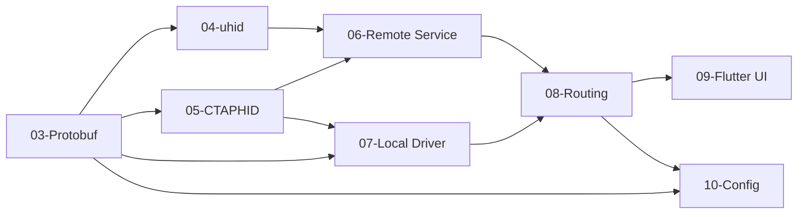

# WebAuthn CTAP Passthrough - Design Documents

## Overview

This feature allows a user controlling a remote machine via RustDesk to authenticate
to websites on the remote machine using a physical FIDO2/WebAuthn security key
connected to their local machine.

When a website on the remote machine requests WebAuthn authentication, the CTAP2
protocol commands are intercepted by a virtual FIDO device on the remote machine,
tunneled through the RustDesk connection to the local machine, presented to the
user's physical security key, and the signed response is returned.

## Target Platform

**Linux only** (initial prototype). Windows and macOS may follow.

## Documents

| # | Document | Audience | Description |
|---|----------|----------|-------------|
| 01 | [Architecture Overview](01-architecture.md) | All developers | System-level design, component diagram, data flow |
| 02 | [Protocol Specification](02-protocol.md) | All developers | Wire formats, message types, timing requirements |
| 03 | [Component: Protobuf Messages](03-component-protobuf.md) | Developer A | New protobuf types in hbb_common |
| 04 | [Component: Virtual FIDO Device (uhid)](04-component-uhid.md) | Developer B | Remote-side virtual authenticator via /dev/uhid |
| 05 | [Component: CTAPHID Framing](05-component-ctaphid.md) | Developer B | CTAPHID packet assembly/disassembly |
| 06 | [Component: Remote Service](06-component-remote-service.md) | Developer C | Server-side service that ties uhid + framing + message routing |
| 07 | [Component: Local Authenticator Driver](07-component-local-driver.md) | Developer D | Client-side communication with physical security key |
| 08 | [Component: Message Routing](08-component-routing.md) | Developer C | Integration into RustDesk's connection lifecycle |
| 09 | [Component: Flutter UI](09-component-flutter-ui.md) | Developer E | "Tap your key" prompts, settings, permission toggle |
| 10 | [Component: Configuration & Permissions](10-component-config.md) | Developer E | Feature flag, permission negotiation, udev setup |
| 11 | [Testing Plan](11-testing.md) | All developers | Unit tests, integration tests, manual test procedures |
| 12 | [Security Analysis](12-security.md) | All developers | Threat model, mitigations, trust boundaries |

## Dependency Graph

**Build order**: 03 first (all components depend on it), then 04+05+07 in parallel,
then 06+08, then 09+10. Testing (11) is ongoing throughout.

## Glossary

| Term | Definition |
|------|-----------|
| CTAP | Client to Authenticator Protocol (FIDO Alliance spec) |
| CTAP2 | Version 2 of CTAP, uses CBOR encoding |
| CTAPHID | CTAP transport binding over USB HID (64-byte reports) |
| FIDO2 | The combination of WebAuthn (browser API) + CTAP2 (authenticator protocol) |
| WebAuthn | W3C Web Authentication API (`navigator.credentials.get/create`) |
| uhid | Linux kernel interface (`/dev/uhid`) for creating virtual HID devices |
| hidraw | Linux kernel interface (`/dev/hidrawN`) for raw HID device access |
| RP | Relying Party - the website requesting authentication |
| CID | Channel Identifier - 4-byte CTAPHID session ID |
| UP | User Presence - physical touch of the authenticator |
| UV | User Verification - PIN or biometric on the authenticator |
