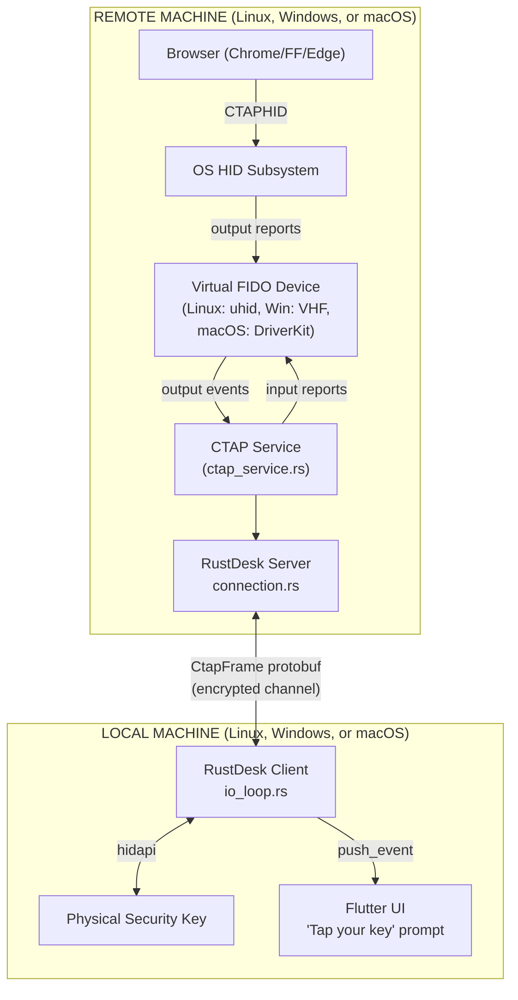
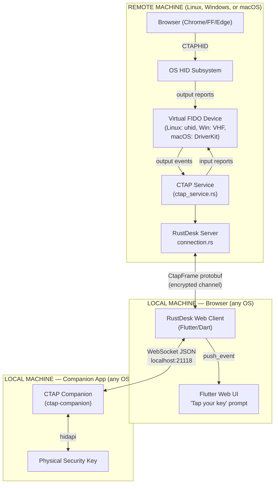
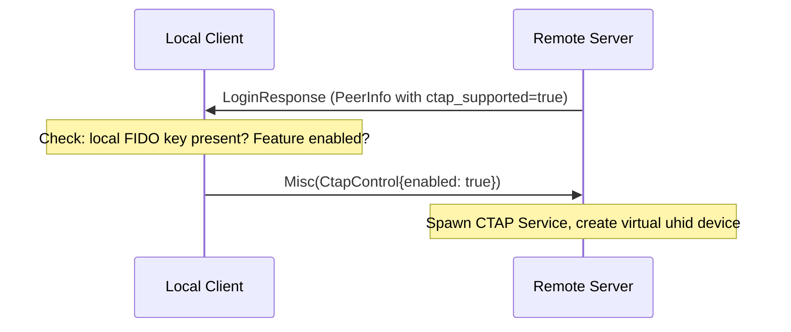
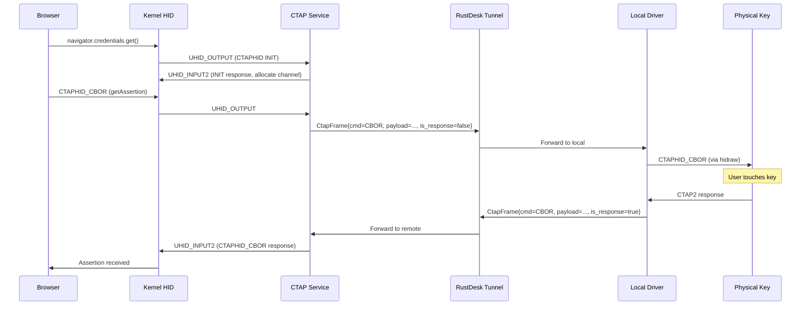
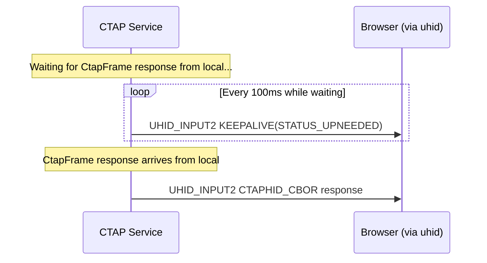

# 01 - Architecture Overview

## System Context

There are two client paths — native and web — that share the same remote-side
architecture but differ in how they reach the physical security key.

### Native Client Path

### Web Client Path

**Why a companion app?** Browsers block raw access to FIDO security keys — WebUSB
blocklists them, WebHID blocklists them, and the WebAuthn API enforces rpId origin
matching (the web client's origin doesn't match the remote website). A small native
companion (~1-2 MB) bridges this gap. See [13-component-companion-app.md](13-component-companion-app.md)
for full details.

### What's Shared

The remote side (everything above the `CtapFrame` boundary) is identical for both
client types. The `CtapFrame` protobuf message is the abstraction boundary — the
remote service doesn't know or care whether the client is native or web.

## Component Summary

There are 7 new components, plus modifications to 5 existing files:

### New Components

| Component | New File(s) | Purpose |
|-----------|-------------|---------|
| Protobuf Messages | `libs/hbb_common/protos/message.proto` (modified) | `CtapFrame` message type |
| Virtual FIDO Device | `src/server/ctap_virtual_device.rs` (trait), `ctap_uhid.rs` (Linux), `ctap_vhf.rs` (Windows), `ctap_driverkit.rs` (macOS) | Creates/manages virtual FIDO device per platform |
| CTAPHID Framing | `libs/ctap-common/src/ctap_hid.rs` | Assembles/disassembles CTAPHID packets from 64-byte HID reports |
| FIDO Relay Logic | `libs/ctap-common/src/fido_relay.rs` | Core CTAP2 relay to physical key via `hidapi` (shared library) |
| Remote CTAP Service | `src/server/ctap_service.rs` | Orchestrates uhid + framing + message forwarding on remote side |
| Local Authenticator Driver (native) | `src/client/ctap_local.rs` | Native client: calls `ctap-common` relay directly in-process |
| Local Authenticator Driver (web) | `flutter/lib/common/widgets/ctap_websocket.dart` | Web client: relays via WebSocket to companion app |
| CTAP Companion App | `ctap-companion/` (standalone crate) | Headless native binary providing WebSocket bridge to FIDO key |
| Flutter UI | `flutter/lib/common/widgets/ctap_prompt.dart` | "Tap your key" dialog (shared by native and web) |
| Configuration | Multiple config locations | Feature flag, permission, udev rules |

### Modified Existing Files

| File | Change |
|------|--------|
| `src/server/connection.rs` | Add `CtapFrame` handling in `on_message()`, spawn CTAP service on auth |
| `src/client/io_loop.rs` | Add `CtapFrame` handling in `handle_msg_from_peer()`, dispatch to native or web driver |
| `src/ipc.rs` | Add `CtapRequest`/`CtapResponse` IPC variants (if IPC-separated architecture chosen) |
| `src/flutter.rs` | Add `authenticator_prompt` event push |
| `flutter/lib/models/model.dart` | Add `authenticator_prompt` event handler, dispatch to `CtapModel` |
| `libs/hbb_common/protos/message.proto` | Add `CtapFrame` message, add to `Message` oneof |

## Data Flow - Detailed Sequence

### Phase 1: Session Setup

### Phase 2: Authentication Request

### Phase 3: Keepalive During User Interaction

While the local driver waits for the user to touch their key, the remote service
must send CTAPHID KEEPALIVE messages to the browser to prevent timeout:

## Design Decisions

### D1: Piggyback on existing connection, not a new ConnType

**Decision**: CTAP messages travel as `CtapFrame` within the existing remote desktop
`Message` union, rather than creating a new `ConnType::CTAP`.

**Rationale**: CTAP transactions are infrequent (a few per authentication event),
small (< 1KB each), and always occur during an active remote desktop session.
A separate connection type would require a separate NAT traversal, authentication,
and connection lifecycle for minimal benefit.

### D2: Opaque payload forwarding

**Decision**: The RustDesk tunnel treats CTAP2 CBOR payloads as opaque bytes. It
does not parse, validate, or transform CTAP2 commands.

**Rationale**: The browser and the physical authenticator both understand CTAP2.
Parsing adds complexity, attack surface, and maintenance burden. The Qubes OS
CTAP proxy takes the same approach. Exception: CTAPHID_INIT and CTAPHID_PING are
handled locally by the virtual device (they are transport-level, not crypto-level).

### D3: CTAPHID framing handled at endpoints, not tunneled

**Decision**: The remote service strips CTAPHID framing (reassembles multi-packet
messages) before sending over the tunnel. The local driver re-frames into CTAPHID
for the physical key.

**Rationale**: CTAPHID framing is a transport-layer concern (64-byte HID report
chunking). The RustDesk channel is a reliable byte stream — sending pre-chunked
64-byte packets wastes bandwidth and adds complexity. Only the CTAP command byte
and CBOR payload cross the tunnel.

### D4: Single authenticator, single transaction

**Decision**: The prototype supports one physical authenticator and one concurrent
CTAP transaction at a time.

**Rationale**: Multiple concurrent CTAP transactions are extremely rare in practice
(browsers serialize them). Multiple authenticators add device-selection UI complexity.
These can be added later without architectural changes.

### D5: Feature gated behind permission toggle

**Decision**: CTAP passthrough is a permission like keyboard/clipboard/file, disabled
by default, controllable per-connection.

**Rationale**: Consistent with RustDesk's permission model. Users must explicitly
opt in. Server operators can disable it via configuration.

### D6: Dual client paths — native driver and web companion

**Decision**: The native client uses `hidapi` directly (in-process). The web client
uses a localhost WebSocket companion app that wraps the same `hidapi` logic. Both
paths share CTAPHID framing and FIDO relay code via `libs/ctap-common/`.

**Rationale**: Browsers block raw FIDO HID access (WebUSB, WebHID blocklists) and
the WebAuthn API enforces rpId origin matching, making a pure browser-side
implementation impossible. A companion app is the smallest bridge that works.
Extracting shared code into `ctap-common` prevents divergence between the two paths.

### D8: Platform-specific virtual device implementations behind a common trait

**Decision**: Each remote platform uses its native mechanism for creating virtual
HID devices (Linux: uhid, Windows: VHF/UMDF2, macOS: DriverKit/IOUserHIDDevice),
all implementing the `VirtualFidoDevice` trait. The CTAP service uses only the trait.

**Rationale**: Each OS has a fundamentally different kernel/driver model for virtual
HID devices. There is no cross-platform abstraction at this level. The trait keeps
the CTAP service (Component 06) platform-agnostic while allowing each implementation
to use native APIs optimally. This mirrors how RustDesk handles virtual input
devices (uinput on Linux, SendInput on Windows, CGEvent on macOS).

### D7: CtapFrame is the abstraction boundary

**Decision**: The remote side (uhid, CTAP service, connection routing) is identical
regardless of client type. The `CtapFrame` protobuf message is the only interface
between remote and local. The remote side does not know whether the client is
native or web.

**Rationale**: This keeps the remote side simple and testable. Any future client
type (mobile, embedded) only needs to implement the local driver side of the
`CtapFrame` protocol.
