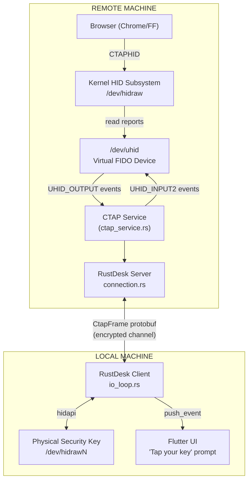
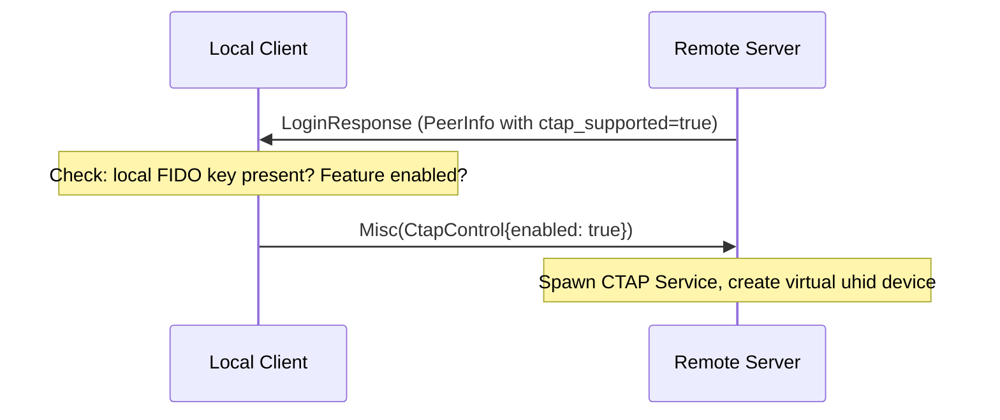
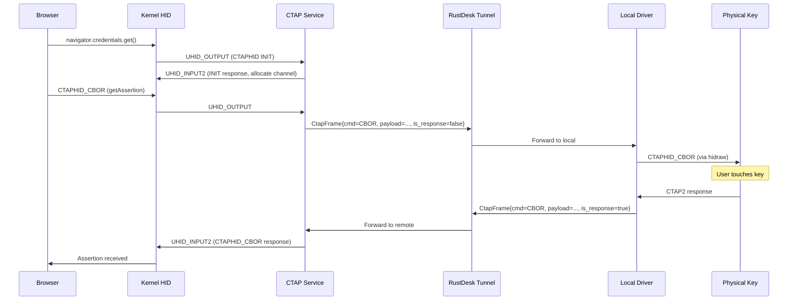
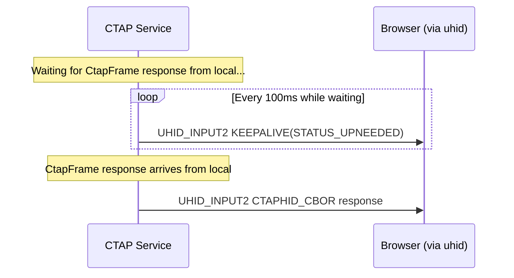

# 01 - Architecture Overview

## System Context

## Component Summary

There are 7 new components, plus modifications to 5 existing files:

### New Components

| Component | New File(s) | Purpose |
|-----------|-------------|---------|
| Protobuf Messages | `libs/hbb_common/protos/message.proto` (modified) | `CtapFrame` message type |
| Virtual FIDO Device | `src/server/ctap_uhid.rs` | Creates/manages virtual FIDO device via `/dev/uhid` |
| CTAPHID Framing | `src/ctap_hid.rs` | Assembles/disassembles CTAPHID packets from 64-byte HID reports |
| Remote CTAP Service | `src/server/ctap_service.rs` | Orchestrates uhid + framing + message forwarding on remote side |
| Local Authenticator Driver | `src/client/ctap_local.rs` | Talks to physical security key via `hidapi` on local side |
| Flutter UI | `flutter/lib/widgets/ctap_prompt.dart` | "Tap your key" dialog |
| Configuration | Multiple config locations | Feature flag, permission, udev rules |

### Modified Existing Files

| File | Change |
|------|--------|
| `src/server/connection.rs` | Add `CtapFrame` handling in `on_message()`, spawn CTAP service on auth |
| `src/client/io_loop.rs` | Add `CtapFrame` handling in `handle_msg_from_peer()`, spawn local driver |
| `src/ipc.rs` | Add `CtapRequest`/`CtapResponse` IPC variants (if IPC-separated architecture chosen) |
| `src/flutter.rs` | Add `authenticator_prompt` event push |
| `libs/hbb_common/protos/message.proto` | Add `CtapFrame` message, add to `Message` oneof |

## Data Flow - Detailed Sequence

### Phase 1: Session Setup

### Phase 2: Authentication Request

### Phase 3: Keepalive During User Interaction

While the local driver waits for the user to touch their key, the remote service
must send CTAPHID KEEPALIVE messages to the browser to prevent timeout:

## Design Decisions

### D1: Piggyback on existing connection, not a new ConnType

**Decision**: CTAP messages travel as `CtapFrame` within the existing remote desktop
`Message` union, rather than creating a new `ConnType::CTAP`.

**Rationale**: CTAP transactions are infrequent (a few per authentication event),
small (< 1KB each), and always occur during an active remote desktop session.
A separate connection type would require a separate NAT traversal, authentication,
and connection lifecycle for minimal benefit.

### D2: Opaque payload forwarding

**Decision**: The RustDesk tunnel treats CTAP2 CBOR payloads as opaque bytes. It
does not parse, validate, or transform CTAP2 commands.

**Rationale**: The browser and the physical authenticator both understand CTAP2.
Parsing adds complexity, attack surface, and maintenance burden. The Qubes OS
CTAP proxy takes the same approach. Exception: CTAPHID_INIT and CTAPHID_PING are
handled locally by the virtual device (they are transport-level, not crypto-level).

### D3: CTAPHID framing handled at endpoints, not tunneled

**Decision**: The remote service strips CTAPHID framing (reassembles multi-packet
messages) before sending over the tunnel. The local driver re-frames into CTAPHID
for the physical key.

**Rationale**: CTAPHID framing is a transport-layer concern (64-byte HID report
chunking). The RustDesk channel is a reliable byte stream — sending pre-chunked
64-byte packets wastes bandwidth and adds complexity. Only the CTAP command byte
and CBOR payload cross the tunnel.

### D4: Single authenticator, single transaction

**Decision**: The prototype supports one physical authenticator and one concurrent
CTAP transaction at a time.

**Rationale**: Multiple concurrent CTAP transactions are extremely rare in practice
(browsers serialize them). Multiple authenticators add device-selection UI complexity.
These can be added later without architectural changes.

### D5: Feature gated behind permission toggle

**Decision**: CTAP passthrough is a permission like keyboard/clipboard/file, disabled
by default, controllable per-connection.

**Rationale**: Consistent with RustDesk's permission model. Users must explicitly
opt in. Server operators can disable it via configuration.
