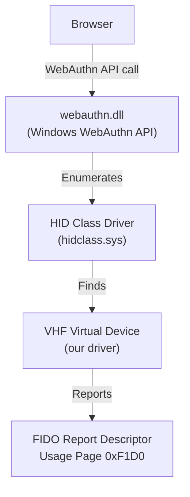
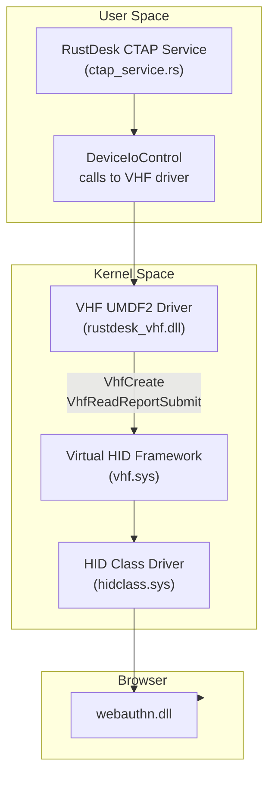
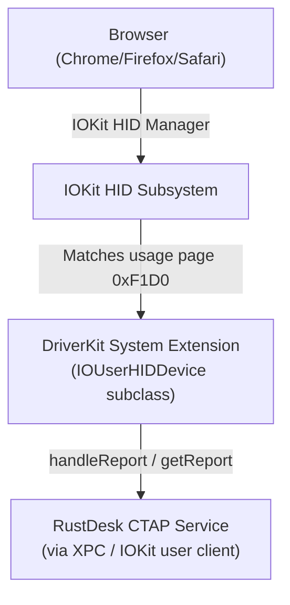
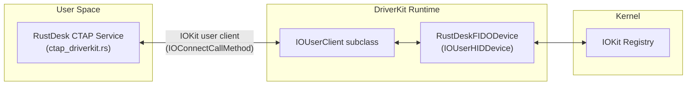
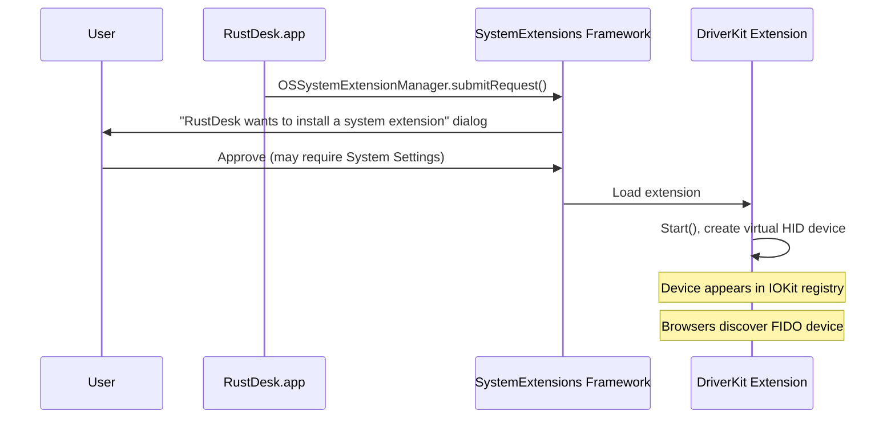

# 04 - Component: Virtual FIDO Device

**Assignee**: Developer B (Linux), Developer F (Windows), Developer G (macOS)
**Estimated effort**: 1-2 weeks (Linux), 3-4 weeks (Windows), 3-4 weeks (macOS)
**Dependencies**: Component 03 (protobuf messages)
**New files**:
- `src/server/ctap_virtual_device.rs` — platform abstraction trait
- `src/server/ctap_uhid.rs` — Linux implementation via `/dev/uhid`
- `src/server/ctap_vhf.rs` — Windows implementation via Virtual HID Framework
- `src/server/ctap_driverkit.rs` — macOS implementation via DriverKit
- `RustDeskFIDO/` — macOS DriverKit system extension project

## Background

The remote CTAP service needs to present a virtual FIDO authenticator to the
operating system's HID subsystem. Browsers discover this device and send CTAPHID
commands to it, which the service intercepts and tunnels to the client.

Each supported remote platform achieves this differently:

| Platform | Mechanism | Interface | Browser Discovery |
|----------|-----------|-----------|-------------------|
| Linux | uhid | `/dev/uhid` → `/dev/hidrawN` | Browsers scan hidraw for FIDO usage page |
| Windows | VHF (Virtual HID Framework) | UMDF2 driver → HID minidriver | Browsers use Windows WebAuthn API / HID class |
| macOS | DriverKit (`IOUserHIDDevice`) | System extension → IOKit HID | Browsers use IOKit HID manager for FIDO usage page |

## Platform Abstraction Trait

All three implementations expose the same interface to the CTAP service (Component 06):

```rust
// src/server/ctap_virtual_device.rs

use hbb_common::ResultType;

/// Platform-agnostic interface for a virtual FIDO HID device.
///
/// The CTAP service (Component 06) uses this trait exclusively. It does not
/// depend on uhid or VHF types directly.
#[async_trait::async_trait]
pub trait VirtualFidoDevice: Send {
    /// Read the next 64-byte output report from the browser.
    ///
    /// Blocks (async) until the browser sends a CTAPHID packet to the virtual
    /// device. Returns the raw 64-byte HID report.
    async fn read_output_report(&self) -> ResultType<[u8; 64]>;

    /// Write a 64-byte input report to the browser.
    ///
    /// Sends a CTAPHID response packet to the browser.
    fn write_input_report(&self, report: &[u8; 64]) -> ResultType<()>;

    /// Destroy the virtual device and clean up.
    fn destroy(&self) -> ResultType<()>;
}

/// Create a virtual FIDO device using the platform-appropriate mechanism.
///
/// - Linux: creates via /dev/uhid
/// - Windows: creates via VHF driver
/// - macOS: creates via DriverKit IOUserHIDDevice
pub fn create_virtual_fido_device() -> ResultType<Box<dyn VirtualFidoDevice>> {
    #[cfg(target_os = "linux")]
    {
        Ok(Box::new(crate::server::ctap_uhid::UhidFidoDevice::new()?))
    }
    #[cfg(target_os = "windows")]
    {
        Ok(Box::new(crate::server::ctap_vhf::VhfFidoDevice::new()?))
    }
    #[cfg(target_os = "macos")]
    {
        Ok(Box::new(crate::server::ctap_driverkit::DriverKitFidoDevice::new()?))
    }
    #[cfg(not(any(target_os = "linux", target_os = "windows", target_os = "macos")))]
    {
        hbb_common::bail!("Virtual FIDO device not supported on this platform");
    }
}
```

## Prerequisites

Before writing code, read:
- **Linux**: kernel docs: https://www.kernel.org/doc/html/latest/hid/uhid.html
  and the existing `src/server/uinput.rs` (virtual keyboard/mouse via `/dev/uinput`)
- **Windows**: Microsoft VHF docs: https://learn.microsoft.com/en-us/windows-hardware/drivers/hid/virtual-hid-framework--vhf-
  and UMDF2 driver development: https://learn.microsoft.com/en-us/windows-hardware/drivers/wdf/getting-started-with-umdf-version-2
- **macOS**: DriverKit overview: https://developer.apple.com/documentation/driverkit
  and HIDDriverKit: https://developer.apple.com/documentation/hiddriverkit
  and `IOUserHIDDevice`: https://developer.apple.com/documentation/hiddriverkit/iouserhiddevice

---

# Part A: Linux Implementation (uhid)

## Requirements

### R1: Create a virtual FIDO HID device

Write a function that opens `/dev/uhid`, writes a `UHID_CREATE2` event with
a FIDO-compatible HID report descriptor, and returns a handle for subsequent I/O.

### R2: Read output reports from the browser

When the browser sends a CTAPHID packet to the virtual device, the kernel delivers
it as a `UHID_OUTPUT` event. Read these events from the uhid file descriptor.

### R3: Write input reports to the browser

To send CTAPHID responses back to the browser, write `UHID_INPUT2` events to
the uhid file descriptor.

### R4: Destroy the device on cleanup

Write a `UHID_DESTROY` event when the CTAP service shuts down, and close the
file descriptor.

### R5: Async-compatible I/O

The uhid file descriptor must be usable with `tokio::select!` alongside other
async channels. Use `tokio::io::unix::AsyncFd` to make the fd non-blocking and
pollable.

## Data Structures

### Kernel ABI Constants

```rust
// uhid event types (from linux/uhid.h)
pub const UHID_DESTROY: u32 = 1;
pub const UHID_START: u32 = 2;
pub const UHID_STOP: u32 = 3;
pub const UHID_OPEN: u32 = 4;
pub const UHID_CLOSE: u32 = 5;
pub const UHID_OUTPUT: u32 = 6;
pub const UHID_CREATE2: u32 = 11;
pub const UHID_INPUT2: u32 = 12;

// Bus types
pub const BUS_USB: u16 = 0x03;

// Max data sizes
pub const UHID_DATA_MAX: usize = 4096;
pub const HID_MAX_DESCRIPTOR_SIZE: usize = 4096;
```

### FIDO HID Report Descriptor

This exact byte sequence makes the kernel recognize the device as a FIDO authenticator.
Do not modify it.

```rust
pub const FIDO_HID_REPORT_DESCRIPTOR: [u8; 34] = [
    0x06, 0xD0, 0xF1,  // Usage Page (FIDO Alliance = 0xF1D0)
    0x09, 0x01,         // Usage (U2F Authenticator Device)
    0xA1, 0x01,         // Collection (Application)
    0x09, 0x20,         //   Usage (Input Report Data)
    0x15, 0x00,         //   Logical Minimum (0)
    0x26, 0xFF, 0x00,   //   Logical Maximum (255)
    0x75, 0x08,         //   Report Size (8 bits)
    0x95, 0x40,         //   Report Count (64)
    0x81, 0x02,         //   Input (Data, Variable, Absolute)
    0x09, 0x21,         //   Usage (Output Report Data)
    0x15, 0x00,         //   Logical Minimum (0)
    0x26, 0xFF, 0x00,   //   Logical Maximum (255)
    0x75, 0x08,         //   Report Size (8 bits)
    0x95, 0x40,         //   Report Count (64)
    0x91, 0x02,         //   Output (Data, Variable, Absolute)
    0xC0,               // End Collection
];
```

**Why these bytes matter:**
- `0x06, 0xD0, 0xF1` — Usage Page 0xF1D0 is registered to the FIDO Alliance. Both
  Chrome and Firefox scan HID report descriptors for this value to identify FIDO devices.
- `0x95, 0x40` — Report Count 64, meaning each HID report is 64 bytes. This matches
  the CTAPHID specification.
- No Report ID is defined, so the kernel will NOT prepend a report ID byte to
  reads/writes on the corresponding hidraw device.

### Kernel Struct Layouts

These structs must match the kernel ABI exactly. Use `#[repr(C, packed)]`.

```rust
/// UHID_CREATE2 request — creates a new HID device
#[repr(C, packed)]
pub struct UhidCreate2Req {
    pub name: [u8; 128],                        // Device name (null-terminated UTF-8)
    pub phys: [u8; 64],                         // Physical path (can be empty)
    pub uniq: [u8; 64],                         // Unique identifier (can be empty)
    pub rd_size: u16,                           // Report descriptor size in bytes
    pub bus: u16,                               // Bus type (BUS_USB = 0x03)
    pub vendor: u32,                            // USB Vendor ID
    pub product: u32,                           // USB Product ID
    pub version: u32,                           // Device version
    pub country: u32,                           // HID country code
    pub rd_data: [u8; HID_MAX_DESCRIPTOR_SIZE], // Report descriptor bytes
}

/// UHID_INPUT2 request — send an input report to the host (device → browser)
#[repr(C, packed)]
pub struct UhidInput2Req {
    pub size: u16,                      // Report data size
    pub data: [u8; UHID_DATA_MAX],      // Report data
}

/// UHID_OUTPUT event — received when host writes an output report (browser → device)
#[repr(C, packed)]
pub struct UhidOutputReq {
    pub data: [u8; UHID_DATA_MAX],      // Report data
    pub size: u16,                      // Report data size
    pub rtype: u8,                      // Report type
}

/// Top-level uhid event — all reads/writes use this structure
#[repr(C, packed)]
pub struct UhidEvent {
    pub type_: u32,                     // Event type (UHID_CREATE2, UHID_INPUT2, etc.)
    pub payload: [u8; UHID_EVENT_PAYLOAD_SIZE], // Union of all req types
}
```

**IMPORTANT**: The `UhidEvent` struct in the kernel is a tagged union. The `type_`
field determines which `payload` interpretation is valid. The total struct size is
fixed at `4 + sizeof(largest union member)`. Calculate the payload size as:
`max(sizeof(UhidCreate2Req), sizeof(UhidInput2Req), sizeof(UhidOutputReq))`.

In practice, `UhidCreate2Req` is the largest at `128 + 64 + 64 + 2 + 2 + 4 + 4 + 4 + 4 + 4096 = 4372 bytes`.
So `UHID_EVENT_PAYLOAD_SIZE = 4376` (the kernel header defines the union at 4380
bytes to accommodate alignment; use `std::mem::size_of` on the kernel struct or
just use 4380 to be safe).

## API Design

```rust
/// Handle to a virtual FIDO device created via /dev/uhid.
/// Implements the VirtualFidoDevice trait (see ctap_virtual_device.rs).
pub struct UhidFidoDevice {
    /// The /dev/uhid file descriptor, wrapped for async I/O.
    fd: tokio::io::unix::AsyncFd<std::fs::File>,
}

impl UhidFidoDevice {
    /// Create a new virtual FIDO device.
    ///
    /// Opens /dev/uhid, writes a UHID_CREATE2 event with the FIDO HID report
    /// descriptor, and returns a handle.
    ///
    /// # Errors
    /// - Permission denied if /dev/uhid is not accessible
    /// - I/O error if the kernel rejects the create request
    pub fn new() -> ResultType<Self>;
}

#[async_trait::async_trait]
impl VirtualFidoDevice for UhidFidoDevice {
    async fn read_output_report(&self) -> ResultType<[u8; 64]>;
    fn write_input_report(&self, report: &[u8; 64]) -> ResultType<()>;
    fn destroy(&self) -> ResultType<()>;
}

impl Drop for UhidFidoDevice {
    fn drop(&mut self) {
        let _ = self.destroy();
    }
}
```

## Implementation Guide

### Step 1: Create the file

Create `src/server/ctap_uhid.rs` and add `pub mod ctap_uhid;` to `src/server/mod.rs`
(or wherever server modules are declared — check the existing pattern).

### Step 2: Implement struct creation

```rust
use std::fs::{File, OpenOptions};
use std::io::Write;
use std::os::unix::io::AsRawFd;
use hbb_common::{bail, log, ResultType};

impl UhidFidoDevice {
    pub fn new() -> ResultType<Self> {
        // 1. Open /dev/uhid
        let file = OpenOptions::new()
            .read(true)
            .write(true)
            .open("/dev/uhid")?;

        // 2. Set non-blocking for async
        let raw_fd = file.as_raw_fd();
        unsafe {
            let flags = libc::fcntl(raw_fd, libc::F_GETFL);
            libc::fcntl(raw_fd, libc::F_SETFL, flags | libc::O_NONBLOCK);
        }

        // 3. Build UHID_CREATE2 event
        //    Zero-initialize the entire event struct, then fill in fields
        let mut event_bytes = vec![0u8; 4 + UHID_EVENT_PAYLOAD_SIZE];

        // type = UHID_CREATE2 (little-endian u32)
        event_bytes[0..4].copy_from_slice(&UHID_CREATE2.to_ne_bytes());

        // name (offset 4, 128 bytes)
        let name = b"RustDesk Virtual FIDO2 Authenticator";
        event_bytes[4..4 + name.len()].copy_from_slice(name);

        // rd_size (offset 4+128+64+64 = 260, 2 bytes, little-endian)
        let rd_size_offset = 4 + 128 + 64 + 64;
        event_bytes[rd_size_offset..rd_size_offset + 2]
            .copy_from_slice(&(FIDO_HID_REPORT_DESCRIPTOR.len() as u16).to_ne_bytes());

        // bus (offset rd_size_offset+2 = 262, 2 bytes)
        let bus_offset = rd_size_offset + 2;
        event_bytes[bus_offset..bus_offset + 2]
            .copy_from_slice(&BUS_USB.to_ne_bytes());

        // vendor (offset 264, 4 bytes) — use 0x1209 (pid.codes open-source VID)
        let vendor_offset = bus_offset + 2;
        event_bytes[vendor_offset..vendor_offset + 4]
            .copy_from_slice(&0x1209u32.to_ne_bytes());

        // product (offset 268, 4 bytes) — use a unique PID for RustDesk
        let product_offset = vendor_offset + 4;
        event_bytes[product_offset..product_offset + 4]
            .copy_from_slice(&0xF1D0u32.to_ne_bytes());

        // version (offset 272, 4 bytes)
        let version_offset = product_offset + 4;
        event_bytes[version_offset..version_offset + 4]
            .copy_from_slice(&0x0100u32.to_ne_bytes());

        // country = 0 (offset 276, 4 bytes) — already zero

        // rd_data (offset 280, up to 4096 bytes)
        let rd_data_offset = version_offset + 4 + 4; // +4 for country
        event_bytes[rd_data_offset..rd_data_offset + FIDO_HID_REPORT_DESCRIPTOR.len()]
            .copy_from_slice(&FIDO_HID_REPORT_DESCRIPTOR);

        // 4. Write the event
        (&file).write_all(&event_bytes)?;

        log::info!("Created virtual FIDO device via /dev/uhid");

        // 5. Wrap in AsyncFd
        let async_fd = tokio::io::unix::AsyncFd::new(file)?;

        Ok(Self { fd: async_fd })
    }
}
```

**CRITICAL NOTE on struct layout**: The offsets above assume `#[repr(C, packed)]`
layout. The actual kernel struct layout must be verified against your kernel headers.
Write a test (see Testing section) that checks `std::mem::size_of` matches
expectations.

**Alternative approach**: Instead of calculating byte offsets manually, define the
Rust structs with `#[repr(C, packed)]` and use `unsafe` transmutation:

```rust
let mut create_req = UhidCreate2Req {
    name: [0u8; 128],
    phys: [0u8; 64],
    uniq: [0u8; 64],
    rd_size: FIDO_HID_REPORT_DESCRIPTOR.len() as u16,
    bus: BUS_USB,
    vendor: 0x1209,
    product: 0xF1D0,
    version: 0x0100,
    country: 0,
    rd_data: [0u8; HID_MAX_DESCRIPTOR_SIZE],
};
create_req.name[..name.len()].copy_from_slice(name);
create_req.rd_data[..FIDO_HID_REPORT_DESCRIPTOR.len()]
    .copy_from_slice(&FIDO_HID_REPORT_DESCRIPTOR);

// Write as tagged event
let type_bytes = UHID_CREATE2.to_ne_bytes();
file.write_all(&type_bytes)?;
let req_bytes = unsafe {
    std::slice::from_raw_parts(
        &create_req as *const _ as *const u8,
        std::mem::size_of::<UhidCreate2Req>(),
    )
};
file.write_all(req_bytes)?;
```

**Pick one approach and be consistent.** The struct-based approach is cleaner but
requires careful alignment verification.

### Step 3: Implement read_output_report

```rust
impl UhidFidoDevice {
    pub async fn read_output_report(&self) -> ResultType<[u8; 64]> {
        loop {
            // Wait for the fd to become readable
            let mut guard = self.fd.readable().await?;

            // Try to read a uhid event
            match guard.try_io(|inner| {
                let mut event_buf = vec![0u8; 4 + UHID_EVENT_PAYLOAD_SIZE];
                let n = nix::unistd::read(inner.as_raw_fd(), &mut event_buf)
                    .map_err(|e| std::io::Error::from_raw_os_error(e as i32))?;
                if n < 4 {
                    return Err(std::io::Error::new(
                        std::io::ErrorKind::InvalidData,
                        "Short uhid read",
                    ));
                }
                Ok(event_buf)
            }) {
                Ok(Ok(buf)) => {
                    let event_type = u32::from_ne_bytes([buf[0], buf[1], buf[2], buf[3]]);
                    match event_type {
                        UHID_OUTPUT => {
                            // Extract the output report data
                            // UhidOutputReq layout: data[4096] + size(u16) + rtype(u8)
                            // Data starts at offset 4 (after type field)
                            let size_offset = 4 + UHID_DATA_MAX;
                            let size = u16::from_ne_bytes([
                                buf[size_offset],
                                buf[size_offset + 1],
                            ]) as usize;

                            if size != 64 {
                                log::warn!("Unexpected FIDO HID report size: {}", size);
                                continue;
                            }

                            let mut report = [0u8; 64];
                            report.copy_from_slice(&buf[4..68]);
                            return Ok(report);
                        }
                        UHID_OPEN => {
                            log::info!("uhid: device opened by a process");
                            continue;
                        }
                        UHID_CLOSE => {
                            log::info!("uhid: device closed");
                            continue;
                        }
                        UHID_START => {
                            log::info!("uhid: device started");
                            continue;
                        }
                        UHID_STOP => {
                            log::info!("uhid: device stopped");
                            continue;
                        }
                        other => {
                            log::debug!("uhid: ignoring event type {}", other);
                            continue;
                        }
                    }
                }
                Ok(Err(e)) => return Err(e.into()),
                Err(_would_block) => continue, // AsyncFd spurious wake
            }
        }
    }
}
```

### Step 4: Implement write_input_report

```rust
impl UhidFidoDevice {
    pub fn write_input_report(&self, report: &[u8; 64]) -> ResultType<()> {
        // Build UHID_INPUT2 event
        let mut event_buf = vec![0u8; 4 + 2 + UHID_DATA_MAX];

        // type = UHID_INPUT2
        event_buf[0..4].copy_from_slice(&UHID_INPUT2.to_ne_bytes());

        // size = 64
        event_buf[4..6].copy_from_slice(&64u16.to_ne_bytes());

        // data
        event_buf[6..70].copy_from_slice(report);

        // Write to uhid fd (synchronous write is fine for small data)
        use std::io::Write;
        let fd = self.fd.get_ref();
        (&*fd).write_all(&event_buf)?;

        Ok(())
    }
}
```

### Step 5: Implement destroy

```rust
impl UhidFidoDevice {
    pub fn destroy(&self) -> ResultType<()> {
        let mut event_buf = vec![0u8; 4 + UHID_EVENT_PAYLOAD_SIZE];
        event_buf[0..4].copy_from_slice(&UHID_DESTROY.to_ne_bytes());

        use std::io::Write;
        let fd = self.fd.get_ref();
        (&*fd).write_all(&event_buf)?;

        log::info!("Destroyed virtual FIDO device");
        Ok(())
    }
}
```

## Testing

### Unit Test: Struct sizes

```rust
#[test]
fn test_uhid_struct_sizes() {
    // Verify our structs match expected kernel ABI sizes
    assert_eq!(std::mem::size_of::<UhidCreate2Req>(), 4372);
    assert_eq!(std::mem::size_of::<UhidInput2Req>(), 4098);
    assert_eq!(std::mem::size_of::<UhidOutputReq>(), 4099);
}
```

### Integration Test: Device creation

This test requires `/dev/uhid` access (run as root or with appropriate permissions):

```rust
#[tokio::test]
#[ignore] // Requires /dev/uhid access
async fn test_create_virtual_fido_device() {
    let device = VirtualFidoDevice::new().expect("Failed to create device");

    // Verify a new /dev/hidraw device appeared
    // (Check /sys/class/hidraw/ for new entries)

    // Cleanup
    device.destroy().expect("Failed to destroy device");
}
```

### Integration Test: Round-trip with hidapi

See [11-testing.md](11-testing.md) for the full integration test that opens the
virtual device from both sides.

## Error Handling

| Error | Cause | Action |
|-------|-------|--------|
| `Permission denied` on `/dev/uhid` | Missing udev rule or not in uhid group | Log error, disable CTAP feature for this session |
| `UHID_CREATE2` write fails | Kernel module not loaded | Log error, suggest `modprobe uhid` |
| Short read from uhid | Kernel bug or fd closed | Return error, service will restart |
| Unexpected report size (!= 64) | Malformed CTAPHID packet | Log warning, skip packet |

## Linux Platform Notes

- Gate with `#[cfg(target_os = "linux")]`.
- `/dev/uhid` requires the `uhid` kernel module (loaded by default on most distros).
- In `src/server/mod.rs`:
  ```rust
  pub mod ctap_virtual_device; // Platform abstraction trait (all platforms)
  #[cfg(target_os = "linux")]
  pub mod ctap_uhid;
  #[cfg(target_os = "windows")]
  pub mod ctap_vhf;
  #[cfg(target_os = "macos")]
  pub mod ctap_driverkit;
  ```

## Linux Acceptance Criteria

- [ ] `UhidFidoDevice::new()` creates a virtual device visible in `/sys/class/hidraw/`
- [ ] The device's HID report descriptor matches `FIDO_HID_REPORT_DESCRIPTOR`
- [ ] `read_output_report()` returns 64-byte reports when a process writes to the hidraw device
- [ ] `write_input_report()` delivers 64-byte reports to processes reading the hidraw device
- [ ] `destroy()` removes the device from `/sys/class/hidraw/`
- [ ] Drop automatically destroys the device
- [ ] All operations are async-compatible (work inside `tokio::select!`)
- [ ] Struct size tests pass
- [ ] Implements `VirtualFidoDevice` trait

---

# Part B: Windows Implementation (Virtual HID Framework)

## Background

Windows does not have a `/dev/uhid` equivalent in user space. Creating a virtual
HID device requires a kernel-mode or UMDF2 (User-Mode Driver Framework v2) driver
that registers with the Windows HID class driver via the **Virtual HID Framework
(VHF)**.

### How Browsers Find FIDO Devices on Windows

On Windows 10 1903+, the FIDO device discovery path differs from Linux:



- **Chrome 100+, Edge**: Always use `webauthn.dll` → Windows HID class
- **Firefox**: Uses its own HID stack by default (`security.webauthn.enable_usbtoken`),
  but can be configured to use `webauthn.dll`. Both paths discover HID devices
  through the Windows HID class driver.
- **Key point**: Both paths ultimately go through the Windows HID class driver,
  so a VHF virtual device is visible to all browsers.

### VHF Architecture



The UMDF2 driver runs in a user-mode host process (`WUDFHost.exe`) but has
kernel-level access to the HID class driver via VHF APIs.

## VHF Driver Design

### Driver Overview

The driver is a minimal UMDF2 driver that:
1. Creates a virtual HID device via `VhfCreate()` with the FIDO report descriptor
2. Receives output reports (browser → device) via a `VHF_CONFIG.EvtVhfReadyForNextReadHidReport` callback
3. Submits input reports (device → browser) via `VhfReadReportSubmit()`
4. Communicates with the RustDesk user-space service via a custom device interface (IOCTLs)

### Driver Files

```
src/platform/windows/vhf_driver/
    rustdesk_vhf.inf          # Driver installation INF
    rustdesk_vhf.c             # UMDF2 driver entry point and VHF callbacks
    device.h                   # Device context, IOCTL definitions
    Makefile / .vcxproj        # Build using WDK (Windows Driver Kit)
```

### IOCTL Interface

The user-space CTAP service communicates with the VHF driver via
`DeviceIoControl()` on a device handle obtained from `CreateFile()` on the
driver's device interface:

| IOCTL | Direction | Data | Description |
|-------|-----------|------|-------------|
| `IOCTL_RUSTDESK_VHF_READ_REPORT` | Driver → User | 64-byte HID report | Read the next output report from the browser. Blocks (pending IRP) until a report is available. |
| `IOCTL_RUSTDESK_VHF_WRITE_REPORT` | User → Driver | 64-byte HID report | Submit an input report to the browser. |
| `IOCTL_RUSTDESK_VHF_GET_STATUS` | Driver → User | Status flags | Check if the device is active (browser has opened it). |

```c
// device.h
#define FILE_DEVICE_RUSTDESK_VHF  0x8000  // Private device type

#define IOCTL_RUSTDESK_VHF_READ_REPORT \
    CTL_CODE(FILE_DEVICE_RUSTDESK_VHF, 0x800, METHOD_BUFFERED, FILE_READ_ACCESS)

#define IOCTL_RUSTDESK_VHF_WRITE_REPORT \
    CTL_CODE(FILE_DEVICE_RUSTDESK_VHF, 0x801, METHOD_BUFFERED, FILE_WRITE_ACCESS)

#define IOCTL_RUSTDESK_VHF_GET_STATUS \
    CTL_CODE(FILE_DEVICE_RUSTDESK_VHF, 0x802, METHOD_BUFFERED, FILE_READ_ACCESS)
```

### Driver VHF Callbacks

```c
// rustdesk_vhf.c (simplified)

NTSTATUS EvtVhfAsyncOperationGetFeature(PVOID VhfClientContext, PHID_XFER_PACKET HidTransferPacket, ...) {
    // Not used for FIDO — return STATUS_NOT_SUPPORTED
}

VOID EvtVhfAsyncOperationWriteReport(PVOID VhfClientContext, HID_XFER_PACKET* HidTransferPacket, ...) {
    // Browser sent an output report (CTAPHID packet)
    // Copy the 64-byte report into a pending-read queue
    // Complete any pending IOCTL_RUSTDESK_VHF_READ_REPORT IRP
    PDEVICE_CONTEXT ctx = (PDEVICE_CONTEXT)VhfClientContext;
    EnqueueOutputReport(ctx, HidTransferPacket->reportBuffer, HidTransferPacket->reportBufferLen);
}

// Called by user space via IOCTL_RUSTDESK_VHF_WRITE_REPORT:
VOID SubmitInputReport(PDEVICE_CONTEXT ctx, PUCHAR reportBuffer, ULONG reportLen) {
    VHF_HID_READ_REPORT_PARAMS params = { ... };
    VhfReadReportSubmit(ctx->VhfHandle, &params);
}
```

## Rust User-Space Integration

### VhfFidoDevice

```rust
// src/server/ctap_vhf.rs

use std::os::windows::io::OwnedHandle;
use windows::Win32::Storage::FileSystem::{CreateFileW, FILE_FLAG_OVERLAPPED};
use windows::Win32::System::IO::DeviceIoControl;

/// Handle to a virtual FIDO device created via the RustDesk VHF driver.
/// Implements the VirtualFidoDevice trait.
pub struct VhfFidoDevice {
    /// Handle to the VHF driver's device interface
    device: OwnedHandle,
}

impl VhfFidoDevice {
    pub fn new() -> ResultType<Self> {
        // 1. Find the device interface using SetupDiGetClassDevs + SetupDiEnumDeviceInterfaces
        // 2. Open with CreateFileW (FILE_FLAG_OVERLAPPED for async)
        // 3. The VHF driver creates the virtual HID device on open
        todo!()
    }
}

#[async_trait::async_trait]
impl VirtualFidoDevice for VhfFidoDevice {
    async fn read_output_report(&self) -> ResultType<[u8; 64]> {
        // Issue IOCTL_RUSTDESK_VHF_READ_REPORT via overlapped I/O
        // The IOCTL blocks (pends) until the browser sends a report
        // Use tokio::io::windows::NamedPipeClient or a manual OVERLAPPED + event
        todo!()
    }

    fn write_input_report(&self, report: &[u8; 64]) -> ResultType<()> {
        // Issue IOCTL_RUSTDESK_VHF_WRITE_REPORT
        todo!()
    }

    fn destroy(&self) -> ResultType<()> {
        // Close the device handle — driver destroys the virtual device
        // (handled by OwnedHandle Drop)
        Ok(())
    }
}

/// Check if the VHF driver is installed and accessible.
pub fn is_driver_available() -> bool {
    // Use SetupDiGetClassDevs to check if the device interface GUID exists
    // This is called by is_ctap_available() in config
    todo!()
}
```

### Async I/O on Windows

Unlike Linux's `AsyncFd`, Windows uses overlapped I/O for async device operations.
The pattern for async IOCTL:

```rust
async fn read_output_report(&self) -> ResultType<[u8; 64]> {
    let mut report = [0u8; 64];
    let mut overlapped = OVERLAPPED::default();
    let event = CreateEventW(None, true, false, None)?;
    overlapped.hEvent = event;

    let result = DeviceIoControl(
        self.device.as_raw_handle(),
        IOCTL_RUSTDESK_VHF_READ_REPORT,
        None, 0,                     // No input buffer
        Some(report.as_mut_ptr() as _), 64, // Output buffer
        None,                         // Bytes returned (via overlapped)
        Some(&mut overlapped),
    );

    if !result.as_bool() {
        let err = GetLastError();
        if err == ERROR_IO_PENDING {
            // Wait asynchronously for the IOCTL to complete
            // Wrap the event in a tokio-compatible waiter
            tokio::task::spawn_blocking(move || {
                WaitForSingleObject(event, INFINITE);
            }).await?;
        } else {
            bail!("DeviceIoControl failed: {:?}", err);
        }
    }

    Ok(report)
}
```

## Driver Deployment

### Build Requirements

- Windows Driver Kit (WDK) 10.0.22621 or later
- Visual Studio 2022 with WDK integration
- UMDF2 target (user-mode driver — simpler than KMDF)

### Driver Signing

Production drivers on Windows must be signed. Options:

| Method | Requirement | Use Case |
|--------|-------------|----------|
| **Test signing** | Enable test signing mode on dev machines | Development only |
| **Attestation signing** | EV code signing certificate + Microsoft Hardware Dashboard | Production (recommended) |
| **WHQL** | Full HLK testing + Microsoft certification | Optional, highest trust |

**Recommendation**: Use attestation signing via the Microsoft Partner Center.
This requires an EV code signing certificate (~$200-400/year) and submission
to the Hardware Dashboard. The signed driver works on all Windows 10/11 machines
without test mode.

### Installation

The driver is packaged as a `.inf` + `.dll` pair and installed via:

```powershell
# Admin PowerShell
pnputil /add-driver rustdesk_vhf.inf /install
```

Or bundled into the RustDesk MSI/NSIS installer, which calls `pnputil` during
installation. The installer should also handle driver updates and removal.

### Alternative: Driver-Free Approach (Future)

Windows 11 24H2+ introduces the **Virtual USB (USBIP)** feature and potential
user-mode HID creation APIs. If Microsoft exposes a user-mode API for virtual
HID devices (similar to Linux uhid), the VHF driver could be replaced. Monitor
Windows SDK releases for this.

## Windows Acceptance Criteria

- [ ] VHF UMDF2 driver builds with WDK
- [ ] Driver creates a virtual HID device visible in Device Manager under "Human Interface Devices"
- [ ] The device's HID report descriptor matches `FIDO_HID_REPORT_DESCRIPTOR`
- [ ] `IOCTL_RUSTDESK_VHF_READ_REPORT` returns 64-byte reports from browser
- [ ] `IOCTL_RUSTDESK_VHF_WRITE_REPORT` delivers 64-byte reports to browser
- [ ] Device is destroyed when the user-space handle is closed
- [ ] Chrome and Edge discover the virtual device via `webauthn.dll`
- [ ] Firefox discovers the virtual device via its HID stack
- [ ] `VhfFidoDevice` implements `VirtualFidoDevice` trait
- [ ] `is_driver_available()` correctly detects driver presence
- [ ] Driver is attestation-signed for production deployment
- [ ] Driver installs cleanly via `pnputil` and via the RustDesk installer
- [ ] Driver uninstalls cleanly (removes virtual device, removes driver package)

---

# Part C: macOS Implementation (DriverKit)

## Background

macOS 10.15 (Catalina) introduced **DriverKit**, a user-space driver framework
that replaces kernel extensions (kexts). The **HIDDriverKit** subset provides
`IOUserHIDDevice`, a base class for creating virtual HID devices from user space.

This is architecturally equivalent to Linux uhid and Windows VHF — a virtual HID
device that the OS HID subsystem exposes to applications (browsers) as if it were
a physical USB device.

### How Browsers Find FIDO Devices on macOS



- **Chrome**: Uses IOKit `IOHIDManager` to enumerate HID devices, filters by
  usage page 0xF1D0. Discovers DriverKit virtual devices.
- **Firefox**: Same IOKit path for FIDO device discovery.
- **Safari**: Uses the macOS platform authenticator API, which internally queries
  IOKit for HID FIDO devices. Also discovers DriverKit virtual devices.

### Why DriverKit (Not IOHIDUserDevice)

macOS also has a private-ish C API, `IOHIDUserDevice`, that can create virtual
HID devices without a full DriverKit extension. However:

| Approach | Pros | Cons |
|----------|------|------|
| **DriverKit** (recommended) | Officially supported, future-proof, works with SIP enabled, App Store compatible | Requires Apple Developer account, entitlement request, Xcode project |
| **IOHIDUserDevice** | Simpler to implement, no driver project needed | Semi-private API, may break on future macOS, may require SIP disable or special entitlement on recent macOS |

We recommend DriverKit as the primary approach. IOHIDUserDevice may be used as a
fallback for development/testing.

## DriverKit System Extension

### Project Structure

The DriverKit extension is a separate Xcode target bundled inside the RustDesk
app:

```
RustDeskFIDO/
    RustDeskFIDO.xcodeproj
    RustDeskFIDODriver/
        Info.plist                  # DriverKit extension metadata
        RustDeskFIDODriver.entitlements
        RustDeskFIDODevice.h        # IOUserHIDDevice subclass declaration
        RustDeskFIDODevice.cpp      # Implementation
        RustDeskFIDODevice.iig      # IOKit Interface Generator file
```

The compiled extension lives at:
```
RustDesk.app/Contents/Library/SystemExtensions/
    com.rustdesk.RustDeskFIDODriver.dext
```

### IOUserHIDDevice Subclass

```cpp
// RustDeskFIDODevice.h

#include <HIDDriverKit/IOUserHIDDevice.iig>

class RustDeskFIDODevice : public IOUserHIDDevice {
public:
    // DriverKit lifecycle
    virtual bool init() override;
    virtual kern_return_t Start(IOService *provider) override;
    virtual kern_return_t Stop(IOService *provider) override;
    virtual void free() override;

    // HID device properties
    virtual OSDictionary *newDeviceDescription() override;
    virtual OSData *newReportDescriptor() override;

    // Report handling
    virtual kern_return_t getReport(IOMemoryDescriptor *report,
                                     IOHIDReportType reportType,
                                     IOOptionBits options,
                                     uint32_t completionTimeout,
                                     OSAction *action) override;

    virtual kern_return_t setReport(IOMemoryDescriptor *report,
                                     IOHIDReportType reportType,
                                     IOOptionBits options,
                                     uint32_t completionTimeout,
                                     OSAction *action) override;
};
```

### Key Callbacks

**`newDeviceDescription()`** — Returns device properties:

```cpp
OSDictionary *RustDeskFIDODevice::newDeviceDescription() {
    auto dict = OSDictionary::withCapacity(6);
    // VID/PID matching the Linux/Windows virtual device
    dict->setObject(kIOHIDVendorIDKey, OSNumber::withNumber(0x1209, 32));
    dict->setObject(kIOHIDProductIDKey, OSNumber::withNumber(0xF1D0, 32));
    dict->setObject(kIOHIDTransportKey, OSString::withCString("Virtual"));
    dict->setObject(kIOHIDManufacturerKey, OSString::withCString("RustDesk"));
    dict->setObject(kIOHIDProductKey,
        OSString::withCString("RustDesk Virtual FIDO2 Authenticator"));
    dict->setObject(kIOHIDVersionNumberKey, OSNumber::withNumber(0x100, 32));
    return dict;
}
```

**`newReportDescriptor()`** — Returns the FIDO HID report descriptor:

```cpp
OSData *RustDeskFIDODevice::newReportDescriptor() {
    // Same 34-byte FIDO HID report descriptor as Linux/Windows
    static const uint8_t descriptor[] = {
        0x06, 0xD0, 0xF1,  // Usage Page (FIDO Alliance = 0xF1D0)
        0x09, 0x01,         // Usage (U2F Authenticator Device)
        0xA1, 0x01,         // Collection (Application)
        0x09, 0x20,         //   Usage (Input Report Data)
        0x15, 0x00,         //   Logical Minimum (0)
        0x26, 0xFF, 0x00,   //   Logical Maximum (255)
        0x75, 0x08,         //   Report Size (8)
        0x95, 0x40,         //   Report Count (64)
        0x81, 0x02,         //   Input (Data, Variable, Absolute)
        0x09, 0x21,         //   Usage (Output Report Data)
        0x15, 0x00,         //   Logical Minimum (0)
        0x26, 0xFF, 0x00,   //   Logical Maximum (255)
        0x75, 0x08,         //   Report Size (8)
        0x95, 0x40,         //   Report Count (64)
        0x91, 0x02,         //   Output (Data, Variable, Absolute)
        0xC0,               // End Collection
    };
    return OSData::withBytes(descriptor, sizeof(descriptor));
}
```

**`setReport()`** — Called when the browser sends an output report (CTAPHID packet):

```cpp
kern_return_t RustDeskFIDODevice::setReport(IOMemoryDescriptor *report, ...) {
    // Read the 64-byte report from the IOMemoryDescriptor
    // Enqueue it for the RustDesk user-space service to read via the user client
    uint8_t buf[64];
    report->readBytes(0, buf, 64);
    enqueueOutputReport(buf, 64);
    return kIOReturnSuccess;
}
```

**Sending input reports** (device → browser):

```cpp
// Called by the RustDesk user-space service via the IOKit user client
void RustDeskFIDODevice::submitInputReport(const uint8_t *data, uint32_t length) {
    auto reportData = OSData::withBytes(data, length);
    handleReport(reportData, kIOHIDReportTypeInput, kIOHIDOptionsTypeNone);
    reportData->release();
}
```

### Communication: DriverKit ↔ RustDesk Service

The DriverKit extension runs in its own process (`DriverKit Runtime`). The
RustDesk CTAP service communicates with it via an **IOKit User Client**:



The user client exposes external methods:

| Method Index | Direction | Description |
|-------------|-----------|-------------|
| 0 | Read (driver → user) | Read next output report (blocks until available) |
| 1 | Write (user → driver) | Submit input report to browser |
| 2 | Read (driver → user) | Get device status |

### Entitlements

The DriverKit extension requires specific entitlements in its `.entitlements` file:

```xml
<?xml version="1.0" encoding="UTF-8"?>
<!DOCTYPE plist PUBLIC "-//Apple//DTD PLIST 1.0//EN"
  "http://www.apple.com/DTDs/PropertyList-1.0.dtd">
<plist version="1.0">
<dict>
    <key>com.apple.developer.driverkit</key>
    <true/>
    <key>com.apple.developer.driverkit.family.hid.device</key>
    <true/>
    <key>com.apple.developer.driverkit.family.hid.virtual.device</key>
    <true/>
    <key>com.apple.developer.driverkit.transport.hid</key>
    <true/>
</dict>
</plist>
```

**Important**: These entitlements must be requested from Apple via the Developer
portal. Apple grants `com.apple.developer.driverkit` entitlements on a
case-by-case basis. The request should explain that this is for creating virtual
FIDO authenticators for remote desktop WebAuthn passthrough.

The **host app** (RustDesk.app) also needs:

```xml
<key>com.apple.developer.system-extension.install</key>
<true/>
```

### System Extension Lifecycle



The extension is installed **once** (persists across reboots). The user approves
it in System Settings → Privacy & Security → Extensions. Subsequent RustDesk
launches reuse the installed extension.

## Rust User-Space Integration

```rust
// src/server/ctap_driverkit.rs

use core_foundation::base::*;
use io_kit_sys::*;

/// Handle to the virtual FIDO device via the DriverKit user client.
pub struct DriverKitFidoDevice {
    /// IOKit connection to the DriverKit user client
    connection: io_connect_t,
}

impl DriverKitFidoDevice {
    pub fn new() -> ResultType<Self> {
        // 1. Find the IOKit service matching our driver class
        let matching = IOServiceMatching(b"RustDeskFIDODevice\0".as_ptr() as *const _);
        let service = IOServiceGetMatchingService(kIOMasterPortDefault, matching);
        if service == 0 {
            bail!("RustDeskFIDO DriverKit extension not found. Is it installed and approved?");
        }

        // 2. Open a user client connection
        let mut connection: io_connect_t = 0;
        let kr = IOServiceOpen(service, mach_task_self(), 0, &mut connection);
        IOObjectRelease(service);
        if kr != KERN_SUCCESS {
            bail!("Failed to open DriverKit user client: {}", kr);
        }

        Ok(Self { connection })
    }
}

#[async_trait::async_trait]
impl VirtualFidoDevice for DriverKitFidoDevice {
    async fn read_output_report(&self) -> ResultType<[u8; 64]> {
        // Call external method 0 on the user client
        // This blocks until the browser sends a report
        let conn = self.connection;
        tokio::task::spawn_blocking(move || {
            let mut report = [0u8; 64];
            let mut output_size = 64u64;
            let kr = IOConnectCallMethod(
                conn,
                0,                      // Method index: read output report
                std::ptr::null(), 0,    // No scalar input
                std::ptr::null(), 0,    // No struct input
                std::ptr::null_mut(), std::ptr::null_mut(), // No scalar output
                report.as_mut_ptr() as _, &mut output_size, // Struct output
            );
            if kr != KERN_SUCCESS {
                bail!("Failed to read output report: {}", kr);
            }
            Ok(report)
        }).await?
    }

    fn write_input_report(&self, report: &[u8; 64]) -> ResultType<()> {
        // Call external method 1 on the user client
        let kr = unsafe {
            IOConnectCallMethod(
                self.connection,
                1,                          // Method index: write input report
                std::ptr::null(), 0,        // No scalar input
                report.as_ptr() as _, 64,   // Struct input: 64-byte report
                std::ptr::null_mut(), std::ptr::null_mut(),
                std::ptr::null_mut(), std::ptr::null_mut(),
            )
        };
        if kr != KERN_SUCCESS {
            bail!("Failed to write input report: {}", kr);
        }
        Ok(())
    }

    fn destroy(&self) -> ResultType<()> {
        // Close the user client connection
        // The DriverKit extension keeps running but the virtual device
        // becomes inactive (no reports accepted/delivered)
        unsafe { IOServiceClose(self.connection) };
        Ok(())
    }
}

impl Drop for DriverKitFidoDevice {
    fn drop(&mut self) {
        let _ = self.destroy();
    }
}

/// Check if the DriverKit extension is installed and available.
pub fn is_driver_available() -> bool {
    unsafe {
        let matching = IOServiceMatching(b"RustDeskFIDODevice\0".as_ptr() as *const _);
        let service = IOServiceGetMatchingService(kIOMasterPortDefault, matching);
        if service != 0 {
            IOObjectRelease(service);
            true
        } else {
            false
        }
    }
}
```

### Dependencies

```toml
# Added to Cargo.toml for macOS
[target.'cfg(target_os = "macos")'.dependencies]
core-foundation = "0.10"
io-kit-sys = "0.4"
```

These are already used by RustDesk for other macOS functionality.

## Driver Deployment

### Build Requirements

- Xcode 14+ with DriverKit support
- Apple Developer account with DriverKit entitlements approved
- macOS 10.15+ deployment target

### Code Signing

| Requirement | Details |
|-------------|---------|
| Developer ID certificate | Required for distribution outside App Store |
| DriverKit entitlement | Must be requested and approved by Apple |
| Notarization | Required for macOS Gatekeeper approval |
| Hardened Runtime | Required for notarization |

### Installation

The DriverKit extension is embedded in the RustDesk.app bundle. On first use:

1. RustDesk calls `OSSystemExtensionManager.submitRequest()` to install the extension
2. macOS prompts the user: "RustDesk wants to install a system extension"
3. User navigates to System Settings → Privacy & Security → Extensions to approve
4. Extension loads, virtual HID device becomes available

Subsequent launches: the extension is already installed and loads automatically.

### Alternative: IOHIDUserDevice (Development Only)

For development and testing without the full DriverKit setup, macOS provides
`IOHIDUserDevice` — a C API for creating virtual HID devices from user space:

```rust
// Development-only alternative (not for production)
extern "C" {
    fn IOHIDUserDeviceCreate(
        allocator: CFAllocatorRef,
        properties: CFDictionaryRef,
    ) -> *mut c_void; // IOHIDUserDeviceRef

    fn IOHIDUserDeviceHandleReport(
        device: *mut c_void,
        report: *const u8,
        reportLength: CFIndex,
    ) -> i32; // IOReturn
}
```

This is simpler but may not work on all macOS versions with SIP enabled.
Use DriverKit for production builds.

## macOS Acceptance Criteria

- [ ] DriverKit extension builds in Xcode with DriverKit entitlements
- [ ] Extension creates a virtual HID device visible in IOKit Registry (`ioreg -l`)
- [ ] The device's HID report descriptor matches `FIDO_HID_REPORT_DESCRIPTOR`
- [ ] Chrome discovers the virtual FIDO device via IOKit HID Manager
- [ ] Firefox discovers the virtual FIDO device via IOKit HID Manager
- [ ] Safari discovers the virtual FIDO device via platform authenticator API
- [ ] User client `read` method returns 64-byte output reports from the browser
- [ ] User client `write` method delivers 64-byte input reports to the browser
- [ ] Device becomes inactive when the user client connection is closed
- [ ] `DriverKitFidoDevice` implements `VirtualFidoDevice` trait
- [ ] `is_driver_available()` correctly detects extension presence
- [ ] Extension installs via `OSSystemExtensionManager` with user approval
- [ ] Extension is signed, notarized, and passes Gatekeeper
- [ ] Extension survives reboot (persists after installation)
