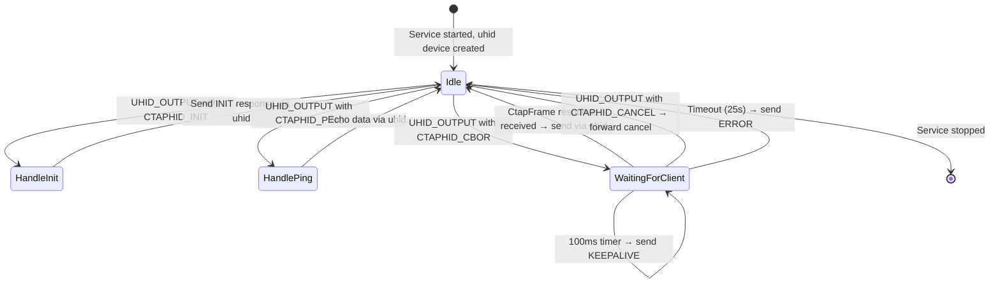
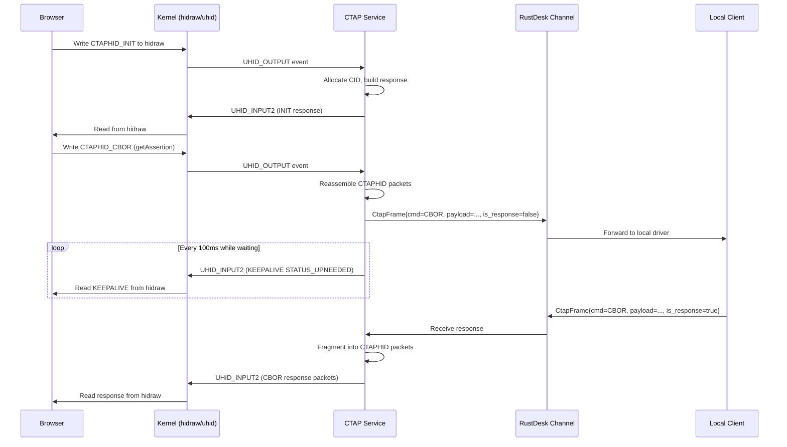

# 06 - Component: Remote CTAP Service

**Assignee**: Developer C
**Estimated effort**: 1-2 weeks
**Dependencies**: Component 03 (protobuf), Component 04 (uhid), Component 05 (CTAPHID)
**New file**: `src/server/ctap_service.rs`

## Background

The remote CTAP service runs on the machine being controlled. It is the orchestrator
that ties together the virtual FIDO device (uhid), CTAPHID framing logic, and
the RustDesk message channel. It:

1. Reads CTAPHID packets from the browser (via uhid)
2. Handles transport-level commands locally (INIT, PING)
3. Forwards CTAP2 CBOR commands to the client (via CtapFrame messages)
4. Sends KEEPALIVE to the browser while waiting for the client's response
5. Delivers the client's response back to the browser (via uhid)

## State Machine



## Data Flow



## API Design

```rust
/// Configuration for the CTAP service
pub struct CtapServiceConfig {
    /// Maximum time to wait for a response from the client (default: 25 seconds)
    pub client_timeout: Duration,
    /// KEEPALIVE interval (default: 100ms)
    pub keepalive_interval: Duration,
}

impl Default for CtapServiceConfig {
    fn default() -> Self {
        Self {
            client_timeout: Duration::from_secs(25),
            keepalive_interval: Duration::from_millis(100),
        }
    }
}

/// Run the CTAP passthrough service on the remote (server) side.
///
/// This function blocks (async) until the service is stopped via the
/// shutdown channel or an unrecoverable error occurs.
///
/// # Arguments
/// - `tx_to_peer`: Channel to send CtapFrame messages to the remote client
/// - `rx_from_peer`: Channel to receive CtapFrame responses from the client
/// - `mut shutdown`: Receives a signal when the service should stop
/// - `config`: Service configuration
///
/// # Lifecycle
/// 1. Creates a virtual FIDO device via uhid
/// 2. Enters the main event loop
/// 3. Destroys the virtual device on exit
pub async fn run_ctap_service(
    tx_to_peer: mpsc::UnboundedSender<Message>,
    mut rx_from_peer: mpsc::UnboundedReceiver<CtapFrame>,
    mut shutdown: oneshot::Receiver<()>,
    config: CtapServiceConfig,
) -> ResultType<()>;
```

## Implementation Guide

### Step 1: Service skeleton

```rust
// src/server/ctap_service.rs

use crate::ctap_hid::*;
use crate::server::ctap_uhid::VirtualFidoDevice;
use hbb_common::{
    allow_err, bail, log,
    message_proto::*,
    protobuf::Message as _,
    tokio::{self, sync::{mpsc, oneshot}, time::{self, Duration, Instant}},
    ResultType,
};

pub async fn run_ctap_service(
    tx_to_peer: mpsc::UnboundedSender<Message>,
    mut rx_from_peer: mpsc::UnboundedReceiver<CtapFrame>,
    mut shutdown: oneshot::Receiver<()>,
    config: CtapServiceConfig,
) -> ResultType<()> {
    // Step 1: Create virtual device
    let device = VirtualFidoDevice::new()?;
    log::info!("CTAP service started, virtual FIDO device created");

    // Step 2: Initialize state
    let mut assembler = CtapHidAssembler::new();
    let mut next_cid: u32 = 1; // Channel allocator (0 is reserved)
    let mut active_cid: Option<u32> = None; // CID of active CBOR transaction

    // Step 3: Main event loop
    let result = run_event_loop(
        &device,
        &tx_to_peer,
        &mut rx_from_peer,
        &mut shutdown,
        &mut assembler,
        &mut next_cid,
        &mut active_cid,
        &config,
    ).await;

    // Step 4: Cleanup
    device.destroy()?;
    log::info!("CTAP service stopped");
    result
}
```

### Step 2: Main event loop

The event loop is the core of the service. It uses `tokio::select!` with up to
four branches:

```rust
async fn run_event_loop(
    device: &VirtualFidoDevice,
    tx_to_peer: &mpsc::UnboundedSender<Message>,
    rx_from_peer: &mut mpsc::UnboundedReceiver<CtapFrame>,
    shutdown: &mut oneshot::Receiver<()>,
    assembler: &mut CtapHidAssembler,
    next_cid: &mut u32,
    active_cid: &mut Option<u32>,
    config: &CtapServiceConfig,
) -> ResultType<()> {
    // Keepalive timer — only active during WaitingForClient state
    let mut keepalive_interval = time::interval(config.keepalive_interval);
    keepalive_interval.set_missed_tick_behavior(time::MissedTickBehavior::Skip);

    // Client response timeout — only active during WaitingForClient state
    let mut client_deadline: Option<Instant> = None;

    loop {
        tokio::select! {
            // Branch 1: Shutdown signal
            _ = &mut *shutdown => {
                log::info!("CTAP service received shutdown signal");
                return Ok(());
            }

            // Branch 2: HID report from browser (via uhid)
            report_result = device.read_output_report() => {
                let report = report_result?;
                handle_uhid_report(
                    &report, device, tx_to_peer, assembler,
                    next_cid, active_cid, &mut client_deadline, config,
                ).await?;
            }

            // Branch 3: Response from client (via RustDesk channel)
            Some(frame) = rx_from_peer.recv(), if active_cid.is_some() => {
                handle_client_response(
                    frame, device, active_cid, assembler,
                ).await?;
                client_deadline = None; // Transaction complete
            }

            // Branch 4: Keepalive timer (only when waiting for client)
            _ = keepalive_interval.tick(), if active_cid.is_some() => {
                if let Some(cid) = *active_cid {
                    // Check timeout
                    if let Some(deadline) = client_deadline {
                        if Instant::now() >= deadline {
                            log::warn!("CTAP client response timeout");
                            send_error(device, cid, ERR_MSG_TIMEOUT)?;
                            *active_cid = None;
                            client_deadline = None;
                            assembler.reset();
                            continue;
                        }
                    }

                    // Send keepalive
                    let ka = CtapHidMessage::keepalive(cid, STATUS_UPNEEDED);
                    send_ctaphid(device, &ka)?;
                }
            }
        }
    }
}
```

### Step 3: Handle uhid reports

```rust
async fn handle_uhid_report(
    report: &[u8; 64],
    device: &VirtualFidoDevice,
    tx_to_peer: &mpsc::UnboundedSender<Message>,
    assembler: &mut CtapHidAssembler,
    next_cid: &mut u32,
    active_cid: &mut Option<u32>,
    client_deadline: &mut Option<Instant>,
    config: &CtapServiceConfig,
) -> ResultType<()> {
    // Feed to assembler
    let msg = match assembler.feed(report) {
        Ok(Some(msg)) => msg,
        Ok(None) => return Ok(()), // Need more packets
        Err(e) => {
            log::warn!("CTAPHID framing error: {}", e);
            // Try to extract CID for error response
            let cid = u32::from_be_bytes([report[0], report[1], report[2], report[3]]);
            send_error(device, cid, ERR_INVALID_SEQ)?;
            assembler.reset();
            return Ok(());
        }
    };

    // Complete message received — dispatch by command
    match msg.cmd {
        CTAPHID_INIT => {
            handle_init(device, &msg, next_cid)?;
        }
        CTAPHID_PING => {
            let resp = CtapHidMessage::ping_response(msg.cid, msg.payload.clone());
            send_ctaphid(device, &resp)?;
        }
        CTAPHID_CBOR => {
            if active_cid.is_some() {
                // Already processing a transaction
                send_error(device, msg.cid, ERR_CHANNEL_BUSY)?;
                return Ok(());
            }

            // Security filter: reject authenticatorReset (0x07)
            if !msg.payload.is_empty() && msg.payload[0] == 0x07 {
                log::warn!("Blocked authenticatorReset command from remote");
                send_error(device, msg.cid, ERR_INVALID_CMD)?;
                return Ok(());
            }

            // Forward to client
            *active_cid = Some(msg.cid);
            *client_deadline = Some(Instant::now() + config.client_timeout);

            let mut proto_msg = Message::new();
            let frame = CtapFrame {
                command: CTAPHID_CBOR as u32,
                payload: msg.payload,
                is_response: false,
                error_code: 0,
                ..Default::default()
            };
            proto_msg.set_ctap_frame(frame);
            tx_to_peer.send(proto_msg)?;

            log::debug!("Forwarded CTAP CBOR request to client, CID={:#010x}", msg.cid);
        }
        CTAPHID_CANCEL => {
            if let Some(cid) = *active_cid {
                if msg.cid == cid {
                    // Forward cancel to client
                    let mut proto_msg = Message::new();
                    let frame = CtapFrame {
                        command: CTAPHID_CANCEL as u32,
                        payload: vec![],
                        is_response: false,
                        error_code: 0,
                        ..Default::default()
                    };
                    proto_msg.set_ctap_frame(frame);
                    tx_to_peer.send(proto_msg)?;

                    *active_cid = None;
                    *client_deadline = None;
                    log::debug!("Forwarded CTAP CANCEL to client");
                }
            }
        }
        CTAPHID_MSG => {
            // Legacy U2F — not supported
            send_error(device, msg.cid, ERR_INVALID_CMD)?;
        }
        _ => {
            log::debug!("Unsupported CTAPHID command: 0x{:02x}", msg.cmd);
            send_error(device, msg.cid, ERR_INVALID_CMD)?;
        }
    }

    Ok(())
}
```

### Step 4: Handle INIT locally

```rust
fn handle_init(
    device: &VirtualFidoDevice,
    msg: &CtapHidMessage,
    next_cid: &mut u32,
) -> ResultType<()> {
    if msg.payload.len() < 8 {
        send_error(device, msg.cid, ERR_INVALID_LEN)?;
        return Ok(());
    }

    let mut nonce = [0u8; 8];
    nonce.copy_from_slice(&msg.payload[..8]);

    let allocated_cid = *next_cid;
    *next_cid += 1;
    if *next_cid == 0 || *next_cid == BROADCAST_CID {
        *next_cid = 1; // Skip 0 and broadcast CID
    }

    let resp = CtapHidMessage::init_response(&nonce, allocated_cid, 0x04);
    send_ctaphid(device, &resp)?;

    log::debug!("Allocated CTAPHID channel CID={:#010x}", allocated_cid);
    Ok(())
}
```

### Step 5: Handle client response

```rust
async fn handle_client_response(
    frame: CtapFrame,
    device: &VirtualFidoDevice,
    active_cid: &mut Option<u32>,
    assembler: &mut CtapHidAssembler,
) -> ResultType<()> {
    let cid = match *active_cid {
        Some(cid) => cid,
        None => {
            log::warn!("Received CTAP response but no active transaction");
            return Ok(());
        }
    };

    if frame.error_code != 0 {
        // Client reported an error — translate to CTAP2 error
        // CTAP2 error response: 1-byte status code
        let error_byte = (frame.error_code & 0xFF) as u8;
        let resp = CtapHidMessage {
            cid,
            cmd: CTAPHID_CBOR,
            payload: vec![error_byte],
        };
        send_ctaphid(device, &resp)?;
    } else {
        // Forward successful response
        let resp = CtapHidMessage {
            cid,
            cmd: frame.command as u8,
            payload: frame.payload,
        };
        send_ctaphid(device, &resp)?;
    }

    *active_cid = None;
    assembler.reset();
    log::debug!("Forwarded CTAP response to browser, CID={:#010x}", cid);
    Ok(())
}
```

### Step 6: Helper to send CTAPHID messages

```rust
fn send_ctaphid(device: &VirtualFidoDevice, msg: &CtapHidMessage) -> ResultType<()> {
    let packets = fragment(msg)?;
    for pkt in &packets {
        device.write_input_report(pkt)?;
    }
    Ok(())
}

fn send_error(device: &VirtualFidoDevice, cid: u32, code: u8) -> ResultType<()> {
    let msg = CtapHidMessage::error(cid, code);
    send_ctaphid(device, &msg)
}
```

## Error Handling

| Scenario | Action |
|----------|--------|
| uhid read error | Log error, attempt reconnect or shutdown service |
| CTAPHID framing error | Send CTAPHID_ERROR to browser, reset assembler |
| Client timeout (25s) | Send CTAPHID_ERROR(MSG_TIMEOUT) to browser, reset state |
| `tx_to_peer` channel closed | RustDesk connection dropped, shutdown service |
| `rx_from_peer` channel closed | RustDesk connection dropped, shutdown service |
| authenticatorReset blocked | Send CTAPHID_ERROR(INVALID_CMD), log warning |
| Multiple concurrent CBOR requests | Send CTAPHID_ERROR(CHANNEL_BUSY) for second request |

## Concurrency Model

The service runs as a single async task within the RustDesk server connection's
tokio runtime. It does NOT spawn additional threads. The `tokio::select!` loop
handles all I/O multiplexing.

The service is spawned by the connection handler (see Component 08) and communicates
via unbounded mpsc channels.

## Testing

### Unit Test: INIT handling

```rust
#[test]
fn test_handle_init_allocates_sequential_cids() {
    // This tests the CID allocation logic in isolation
    let mut next_cid = 1u32;

    // Simulate 3 INIT requests
    for expected in [1u32, 2, 3] {
        let allocated = next_cid;
        next_cid += 1;
        assert_eq!(allocated, expected);
    }
}
```

### Integration test

See [11-testing.md](11-testing.md) for the full end-to-end integration test.

## Acceptance Criteria

- [ ] Service creates a virtual FIDO device on start
- [ ] Service destroys the virtual FIDO device on stop
- [ ] CTAPHID_INIT is handled locally with correct CID allocation
- [ ] CTAPHID_PING echoes data back correctly
- [ ] CTAPHID_CBOR is forwarded to the client as a CtapFrame
- [ ] KEEPALIVE is sent every 100ms while waiting for client response
- [ ] Client response is forwarded back to the browser via uhid
- [ ] Timeout after 25s sends ERROR to browser
- [ ] CTAPHID_CANCEL is forwarded to client
- [ ] authenticatorReset (0x07) is blocked
- [ ] CTAPHID_MSG (legacy U2F) is rejected with INVALID_CMD
- [ ] Service shuts down cleanly on shutdown signal
- [ ] Service shuts down cleanly when peer channel closes
