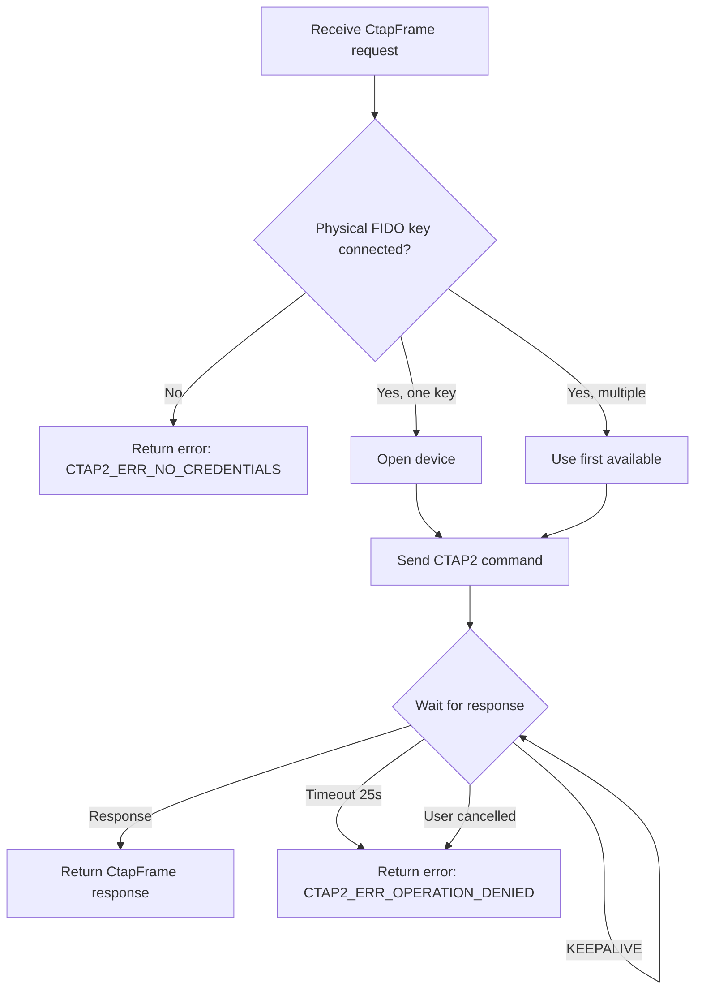
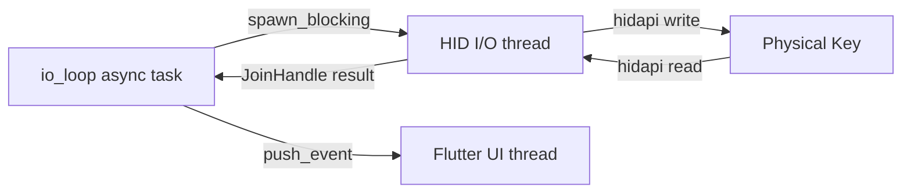

# 07 - Component: Local Authenticator Driver (Native Client)

**Assignee**: Developer D
**Estimated effort**: 1-2 weeks
**Dependencies**: Component 03 (protobuf), Component 05 (CTAPHID framing)
**New files**: `src/client/ctap_local.rs`, `libs/ctap-common/src/fido_relay.rs`
**New dependency**: `hidapi = { version = "2.6", features = ["linux-native"] }`

## Background

The local authenticator driver runs on the machine where the user sits. It
receives CTAP2 CBOR commands from the remote service (via CtapFrame messages),
presents them to a physical FIDO2 security key connected via USB, and returns
the signed response.

This component handles:
1. Enumerating FIDO HID devices
2. Opening a device and managing its lifecycle
3. Sending CTAPHID_CBOR commands to the physical key
4. Receiving responses (including handling KEEPALIVE from the key)
5. Reporting errors back to the remote service

## Relationship to the Companion App (Component 13)

This component is for the **native RustDesk client**. The **web client** uses the
CTAP Companion App ([13-component-companion-app.md](13-component-companion-app.md))
instead, which provides the same FIDO relay logic over a localhost WebSocket.

The core relay logic (`LocalAuthenticator`, `relay_command`, channel allocation,
HID read/write) is extracted into a shared library crate `libs/ctap-common/` so
that both this component and the companion app use the same code. The native
client's `ctap_local.rs` is a thin wrapper that calls `ctap-common` and integrates
with `io_loop.rs`. The companion app's `fido_relay.rs` calls the same `ctap-common`
functions and integrates with the WebSocket server.

```
libs/ctap-common/
    src/
        lib.rs
        ctap_hid.rs       # CTAPHID framing (moved from Component 05)
        fido_relay.rs      # LocalAuthenticator, relay_command, HID I/O

src/client/ctap_local.rs   # Native client wrapper: spawn_blocking + io_loop integration
ctap-companion/src/
    fido_relay.rs           # Companion wrapper: WebSocket ↔ ctap-common bridge
```

## Device Discovery



## Platform Support

The local authenticator driver supports **Linux, Windows, and macOS**. The `hidapi`
crate provides a cross-platform HID API with platform-specific backends:

| Platform | hidapi Backend | Discovery Method | Notes |
|----------|---------------|------------------|-------|
| Linux | hidraw (native) | Usage page 0xF1D0 via hidraw | Requires `linux-native` feature |
| Windows | Windows HID API | Usage page 0xF1D0 via `HidP_GetCaps` | Works out of the box |
| macOS | IOHidManager | Usage page 0xF1D0 via IOKit | Works out of the box |

## Dependencies

### hidapi Crate

Add to `Cargo.toml` (in the `ctap-common` shared library):

```toml
# libs/ctap-common/Cargo.toml
[dependencies]
hidapi = "2.6"

[target.'cfg(target_os = "linux")'.dependencies]
hidapi = { version = "2.6", features = ["linux-native"] }
```

**Linux `linux-native` feature**: The default hidapi backend on Linux uses libusb,
which cannot read HID usage pages. The `linux-native` feature uses the hidraw
backend directly, which supports `usage_page()` filtering — essential for finding
FIDO devices. On Windows and macOS, the default backend already supports usage page
filtering.

**Why NOT `ctap-hid-fido2` or `libfido2`**: These crates provide higher-level
FIDO2 APIs that own the CTAP protocol parsing. We want raw CTAPHID-level access
because we are forwarding opaque CBOR payloads, not interpreting them.

### Platform-Specific Permissions

| Platform | Requirement |
|----------|------------|
| Linux | User in `plugdev` group, or udev rules granting hidraw access |
| Windows | No special permissions — USB HID devices are user-accessible by default |
| macOS | App must have `com.apple.security.device.usb` entitlement if sandboxed; unsigned apps work without restriction |

## API Design

```rust
/// Handle to a physical FIDO2 authenticator connected via USB.
pub struct LocalAuthenticator {
    /// hidapi device handle (not Send/Sync — used only in blocking thread)
    device: hidapi::HidDevice,
}

/// Result of attempting to relay a CTAP command to the physical authenticator.
pub enum CtapRelayResult {
    /// Successful response from the authenticator
    Response(Vec<u8>),
    /// Error from the authenticator or driver
    Error(u32), // CTAP2 error code
}

impl LocalAuthenticator {
    /// Find and open the first available FIDO2 authenticator.
    ///
    /// Enumerates USB HID devices, filters for FIDO Alliance usage page (0xF1D0),
    /// and opens the first matching device.
    ///
    /// # Errors
    /// - No FIDO device found
    /// - Permission denied on hidraw device
    /// - Device open failed
    pub fn open_first() -> ResultType<Self>;

    /// Send a CTAP2 CBOR command and wait for the response.
    ///
    /// This is a BLOCKING function. Call from `tokio::task::spawn_blocking`.
    ///
    /// # Arguments
    /// - `cbor_payload`: Raw CTAP2 CBOR data (starts with command byte, e.g., 0x02 for getAssertion)
    /// - `timeout`: Maximum time to wait for user interaction
    /// - `cancel`: Checked periodically; if it receives a value, the operation is cancelled
    ///
    /// # Returns
    /// - `CtapRelayResult::Response(bytes)`: The raw CTAP2 response (starts with status byte)
    /// - `CtapRelayResult::Error(code)`: CTAP2 error status code
    pub fn relay_command(
        &self,
        cbor_payload: &[u8],
        timeout: Duration,
        cancel: &std::sync::mpsc::Receiver<()>,
    ) -> CtapRelayResult;
}

/// Async wrapper that spawns the blocking relay on a dedicated thread.
///
/// # Arguments
/// - `cbor_payload`: CTAP2 CBOR command to relay
/// - `cancel_tx`: Sender to signal cancellation (kept by the caller)
///
/// # Returns
/// A CtapFrame ready to send back to the remote service.
pub async fn relay_to_physical_key(
    cbor_payload: Vec<u8>,
    cancel_rx: std::sync::mpsc::Receiver<()>,
) -> CtapFrame;
```

## Implementation Guide

### Step 1: Device enumeration

```rust
use hidapi::HidApi;

const FIDO_USAGE_PAGE: u16 = 0xF1D0;
const FIDO_USAGE: u16 = 0x01;

impl LocalAuthenticator {
    pub fn open_first() -> ResultType<Self> {
        let api = HidApi::new()?;

        let device_info = api
            .device_list()
            .find(|d| d.usage_page() == FIDO_USAGE_PAGE && d.usage() == FIDO_USAGE)
            .ok_or_else(|| {
                anyhow::anyhow!("No FIDO2 authenticator found. Is a security key connected?")
            })?;

        log::info!(
            "Found FIDO device: {} (VID={:04x}, PID={:04x}, path={:?})",
            device_info.product_string().unwrap_or("Unknown"),
            device_info.vendor_id(),
            device_info.product_id(),
            device_info.path(),
        );

        let device = device_info.open_device(&api)?;
        Ok(Self { device })
    }
}
```

**Cross-platform note**: `usage_page()` filtering works on all three platforms:
- Linux (hidraw backend): reads usage page from the sysfs report descriptor
- Windows: reads usage page via `HidP_GetCaps` / `HidP_GetValueCaps`
- macOS: reads usage page via IOKit `kIOHIDPrimaryUsagePageKey`

**IMPORTANT**: `HidApi::new()` enumerates all devices, which takes ~10-50ms.
Do not call it in a hot loop. Open the device once per CTAP transaction.

### Step 2: Relay command to physical key

The physical key expects full CTAPHID framing, not raw CTAP2 CBOR. We must:
1. Allocate a channel (send CTAPHID_INIT)
2. Send the CBOR command (CTAPHID_CBOR)
3. Handle KEEPALIVE messages while waiting
4. Read the response

```rust
impl LocalAuthenticator {
    pub fn relay_command(
        &self,
        cbor_payload: &[u8],
        timeout: Duration,
        cancel: &std::sync::mpsc::Receiver<()>,
    ) -> CtapRelayResult {
        // Step 1: Channel allocation
        let cid = match self.allocate_channel() {
            Ok(cid) => cid,
            Err(e) => {
                log::error!("CTAPHID INIT failed: {}", e);
                return CtapRelayResult::Error(0x01); // CTAP1_ERR_OTHER
            }
        };

        // Step 2: Send CBOR command
        let msg = CtapHidMessage {
            cid,
            cmd: CTAPHID_CBOR,
            payload: cbor_payload.to_vec(),
        };
        if let Err(e) = self.send_message(&msg) {
            log::error!("Failed to send CTAP command: {}", e);
            return CtapRelayResult::Error(0x01);
        }

        // Step 3: Wait for response, handling KEEPALIVEs
        let deadline = std::time::Instant::now() + timeout;
        loop {
            // Check cancellation
            if cancel.try_recv().is_ok() {
                log::info!("CTAP operation cancelled by user");
                // Send CTAPHID_CANCEL to the key
                let cancel_msg = CtapHidMessage {
                    cid,
                    cmd: CTAPHID_CANCEL,
                    payload: vec![],
                };
                let _ = self.send_message(&cancel_msg);
                return CtapRelayResult::Error(0x2D); // CTAP2_ERR_KEEPALIVE_CANCEL
            }

            // Check timeout
            let remaining = deadline.saturating_duration_since(std::time::Instant::now());
            if remaining.is_zero() {
                log::warn!("CTAP operation timed out");
                return CtapRelayResult::Error(0x2D);
            }

            // Read with short timeout (100ms) to allow cancel checks
            let read_timeout = remaining.min(Duration::from_millis(100));
            match self.read_message(cid, read_timeout) {
                Ok(Some(resp)) => {
                    if resp.cmd == CTAPHID_KEEPALIVE {
                        // Authenticator is still processing
                        log::trace!("Received KEEPALIVE from physical key");
                        continue;
                    }
                    if resp.cmd == CTAPHID_CBOR {
                        return CtapRelayResult::Response(resp.payload);
                    }
                    if resp.cmd == CTAPHID_ERROR {
                        let code = resp.payload.first().copied().unwrap_or(0x7F);
                        return CtapRelayResult::Error(code as u32);
                    }
                    log::warn!("Unexpected CTAPHID response: cmd=0x{:02x}", resp.cmd);
                    continue;
                }
                Ok(None) => {
                    // Timeout on this read — loop back and check cancel/deadline
                    continue;
                }
                Err(e) => {
                    log::error!("Error reading from authenticator: {}", e);
                    return CtapRelayResult::Error(0x01);
                }
            }
        }
    }
}
```

### Step 3: Channel allocation (CTAPHID_INIT)

```rust
impl LocalAuthenticator {
    fn allocate_channel(&self) -> ResultType<u32> {
        // Generate random nonce
        let mut nonce = [0u8; 8];
        use rand::RngCore;
        rand::thread_rng().fill_bytes(&mut nonce);

        // Send INIT on broadcast channel
        let init_msg = CtapHidMessage {
            cid: BROADCAST_CID,
            cmd: CTAPHID_INIT,
            payload: nonce.to_vec(),
        };
        self.send_message(&init_msg)?;

        // Read response (timeout: 1 second)
        match self.read_message(BROADCAST_CID, Duration::from_secs(1))? {
            Some(resp) => {
                if resp.cmd != CTAPHID_INIT || resp.payload.len() < 17 {
                    bail!("Invalid INIT response");
                }
                // Verify nonce echo
                if resp.payload[..8] != nonce {
                    bail!("INIT nonce mismatch");
                }
                // Extract allocated CID
                let cid = u32::from_be_bytes([
                    resp.payload[8], resp.payload[9],
                    resp.payload[10], resp.payload[11],
                ]);
                log::debug!("Allocated CID {:#010x} from physical key", cid);
                Ok(cid)
            }
            None => bail!("INIT response timeout"),
        }
    }
}
```

### Step 4: Low-level HID read/write

```rust
impl LocalAuthenticator {
    /// Send a CTAPHID message (fragment and write to HID device)
    fn send_message(&self, msg: &CtapHidMessage) -> ResultType<()> {
        let packets = fragment(msg)?;
        for pkt in &packets {
            // hidapi write: first byte is report ID (0x00 for FIDO devices with no report ID)
            let mut buf = [0u8; 65]; // 1 report ID + 64 data
            buf[0] = 0x00;
            buf[1..65].copy_from_slice(pkt);
            self.device.write(&buf)?;
        }
        Ok(())
    }

    /// Read a complete CTAPHID message from the device.
    ///
    /// Returns None on timeout.
    fn read_message(&self, expected_cid: u32, timeout: Duration) -> ResultType<Option<CtapHidMessage>> {
        let mut assembler = CtapHidAssembler::new();
        let deadline = std::time::Instant::now() + timeout;

        loop {
            let remaining = deadline.saturating_duration_since(std::time::Instant::now());
            if remaining.is_zero() {
                return Ok(None);
            }

            let timeout_ms = remaining.as_millis().min(i32::MAX as u128) as i32;
            let mut buf = [0u8; 64];
            let n = self.device.read_timeout(&mut buf, timeout_ms)?;

            if n == 0 {
                return Ok(None); // Timeout
            }
            if n != 64 {
                log::warn!("Short HID read: {} bytes", n);
                continue;
            }

            match assembler.feed(&buf) {
                Ok(Some(msg)) => {
                    // Verify CID (except for broadcast responses)
                    if expected_cid != BROADCAST_CID && msg.cid != expected_cid {
                        log::warn!(
                            "CID mismatch: expected {:#010x}, got {:#010x}",
                            expected_cid, msg.cid
                        );
                        assembler.reset();
                        continue;
                    }
                    return Ok(Some(msg));
                }
                Ok(None) => continue, // Need more packets
                Err(e) => {
                    log::warn!("CTAPHID framing error from physical key: {}", e);
                    assembler.reset();
                    continue;
                }
            }
        }
    }
}
```

### Step 5: Async wrapper

```rust
/// Async entry point called from the client io_loop.
///
/// Spawns a blocking thread for HID I/O and returns the result.
pub async fn relay_to_physical_key(
    cbor_payload: Vec<u8>,
    cancel_rx: std::sync::mpsc::Receiver<()>,
) -> CtapFrame {
    let result = tokio::task::spawn_blocking(move || {
        // Open the authenticator (fresh each time — handles hot-plug)
        let auth = match LocalAuthenticator::open_first() {
            Ok(a) => a,
            Err(e) => {
                log::error!("No FIDO authenticator available: {}", e);
                return CtapRelayResult::Error(0x2E); // CTAP2_ERR_NO_CREDENTIALS
            }
        };

        auth.relay_command(
            &cbor_payload,
            Duration::from_secs(25),
            &cancel_rx,
        )
    }).await;

    match result {
        Ok(CtapRelayResult::Response(payload)) => {
            CtapFrame {
                command: CTAPHID_CBOR as u32,
                payload,
                is_response: true,
                error_code: 0,
                ..Default::default()
            }
        }
        Ok(CtapRelayResult::Error(code)) => {
            CtapFrame {
                command: CTAPHID_CBOR as u32,
                payload: vec![],
                is_response: true,
                error_code: code,
                ..Default::default()
            }
        }
        Err(e) => {
            log::error!("CTAP relay task panicked: {}", e);
            CtapFrame {
                command: CTAPHID_CBOR as u32,
                payload: vec![],
                is_response: true,
                error_code: 0x01, // CTAP1_ERR_OTHER
                ..Default::default()
            }
        }
    }
}
```

## Threading Model



**Why `spawn_blocking`**: The `hidapi` crate is not async. `HidDevice::read_timeout()`
blocks the calling thread. `tokio::task::spawn_blocking` moves this to a dedicated
thread pool so it doesn't block the async runtime.

**Why open per-transaction**: Opening the device fresh each time handles USB
hot-plug gracefully. If the user unplugs and re-plugs their key between
transactions, the next open will find it. The cost is ~10-50ms per open,
which is negligible compared to the ~5-30 second user interaction time.

## CTAP2 Error Codes (Reference)

These are the status codes returned by authenticators in the first byte of a
CTAP2 response. We forward them opaquely, but they are listed here for debugging:

| Code | Name | Meaning |
|------|------|---------|
| 0x00 | CTAP2_OK | Success |
| 0x01 | CTAP1_ERR_INVALID_COMMAND | Invalid command |
| 0x02 | CTAP1_ERR_INVALID_PARAMETER | Invalid parameter |
| 0x11 | CTAP2_ERR_CBOR_UNEXPECTED_TYPE | CBOR parsing error |
| 0x19 | CTAP2_ERR_MISSING_PARAMETER | Required parameter missing |
| 0x27 | CTAP2_ERR_OPERATION_DENIED | User denied or operation not permitted |
| 0x29 | CTAP2_ERR_KEY_STORE_FULL | No space for new credential |
| 0x2D | CTAP2_ERR_KEEPALIVE_CANCEL | Operation cancelled |
| 0x2E | CTAP2_ERR_NO_CREDENTIALS | No matching credentials |
| 0x31 | CTAP2_ERR_USER_ACTION_TIMEOUT | User didn't respond in time |
| 0x36 | CTAP2_ERR_UV_BLOCKED | UV (PIN/biometric) blocked |

## Testing

### Unit Test: Device enumeration mock

For CI environments without physical FIDO keys, mock the hidapi layer:

```rust
#[cfg(test)]
mod tests {
    use super::*;

    #[test]
    fn test_ctap_relay_result_error_mapping() {
        let frame = match CtapRelayResult::Error(0x27) {
            CtapRelayResult::Error(code) => CtapFrame {
                command: CTAPHID_CBOR as u32,
                payload: vec![],
                is_response: true,
                error_code: code,
                ..Default::default()
            },
            _ => unreachable!(),
        };
        assert_eq!(frame.error_code, 0x27);
        assert!(frame.is_response);
        assert!(frame.payload.is_empty());
    }
}
```

### Integration Test: Real key

See [11-testing.md](11-testing.md) for tests requiring a physical security key.

## Acceptance Criteria

- [ ] `LocalAuthenticator::open_first()` finds FIDO devices by usage page 0xF1D0
- [ ] Channel allocation (CTAPHID_INIT) works with physical keys
- [ ] CTAP2 commands are correctly framed as CTAPHID_CBOR and sent to the key
- [ ] KEEPALIVE from the physical key is handled (wait continues)
- [ ] Successful responses are returned as `CtapRelayResult::Response`
- [ ] Errors (no key, timeout, denied) are returned as `CtapRelayResult::Error`
- [ ] Cancellation signal terminates the relay and sends CTAPHID_CANCEL to the key
- [ ] `relay_to_physical_key()` runs on a blocking thread (doesn't block async runtime)
- [ ] Device is opened fresh per transaction (handles hot-plug)
- [ ] Code compiles and works on Linux, Windows, and macOS
- [ ] Usage page filtering (0xF1D0) works on all three platforms
- [ ] HID report write prepends 0x00 report ID on all platforms (hidapi requirement)
