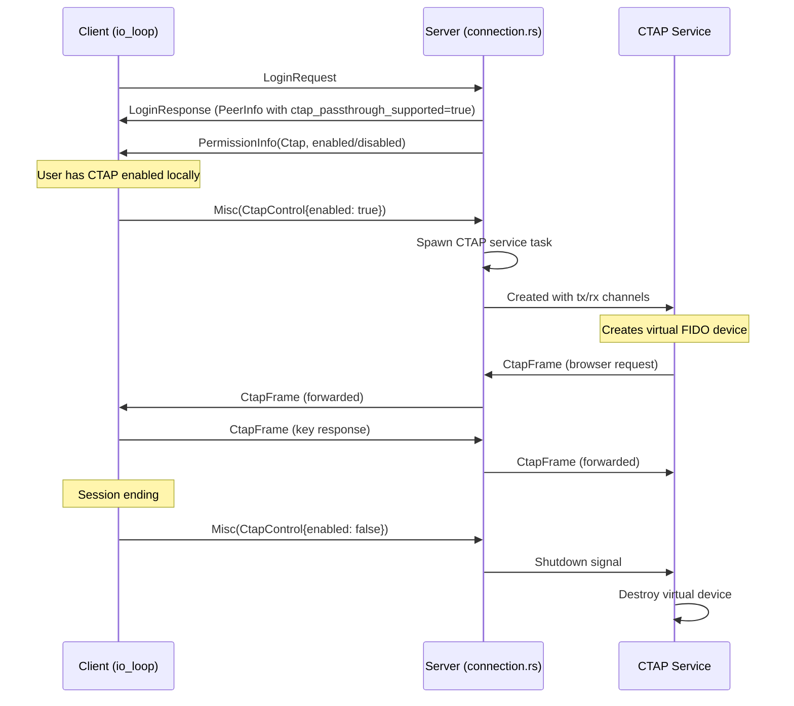
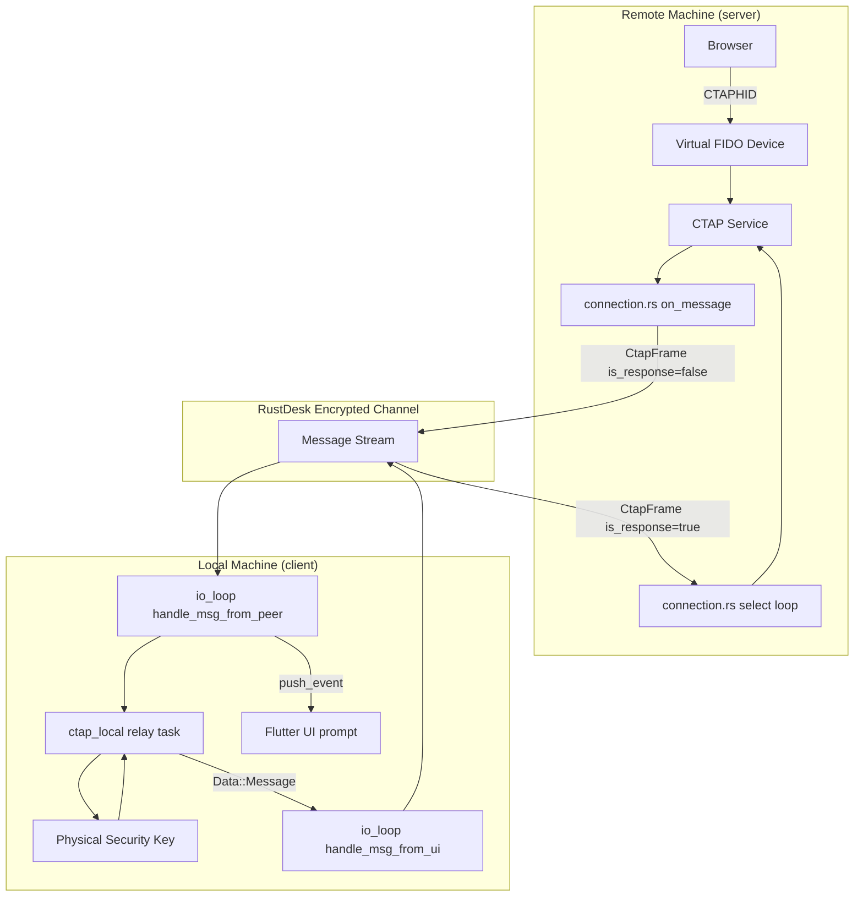

# 08 - Component: Message Routing

**Assignee**: Developer C
**Estimated effort**: 3-5 days
**Dependencies**: Component 03 (protobuf), Component 06 (remote service), Component 07 (local driver)
**Files to modify**:
- `src/server/connection.rs`
- `src/client/io_loop.rs`
- `src/flutter.rs`

## Background

This component integrates the CTAP passthrough feature into RustDesk's existing
connection lifecycle. It adds message routing for `CtapFrame` messages on both
the server (remote) and client (local) sides, and spawns/shuts down the CTAP
service at the appropriate times.

Study these existing patterns before implementing:
- Port forwarding in `src/port_forward.rs` — bidirectional relay with `tokio::select!`
- Terminal service in `src/server/terminal_service.rs` — recent feature addition showing the full integration pattern
- Permission handling in `src/server/connection.rs` — `send_permission()` and the `SwitchPermission` IPC handler

## Server-Side Changes (connection.rs)

### Connection Lifecycle with CTAP



### R1: Add CTAP state to Connection struct

In `src/server/connection.rs`, add fields to the `Connection` struct:

```rust
// In the Connection struct definition (around line 237):
pub struct Connection {
    // ... existing fields ...

    /// Whether CTAP passthrough is permitted for this connection
    ctap: bool,
    /// Channel to send CtapFrame messages to the CTAP service
    ctap_tx: Option<mpsc::UnboundedSender<CtapFrame>>,
    /// Shutdown signal for the CTAP service task
    ctap_shutdown: Option<oneshot::Sender<()>>,
}
```

### R2: Initialize CTAP permission

In the Connection initialization (around line 426, where other permissions are set):

```rust
ctap: Self::permission(keys::OPTION_ENABLE_CTAP, &control_permissions),
ctap_tx: None,
ctap_shutdown: None,
```

### R3: Send CTAP permission on login

In the post-authorization permission broadcast (around line 506), add:

```rust
if !conn.ctap {
    conn.send_permission(Permission::Ctap, false).await;
}
```

### R4: Handle CtapControl in Misc messages

In the `on_message()` handler, where `Misc` union variants are matched, add:

```rust
Some(misc::Union::CtapControl(ctrl)) => {
    if ctrl.enabled && self.ctap {
        self.start_ctap_service().await;
    } else {
        self.stop_ctap_service().await;
    }
}
```

### R5: Handle CtapFrame messages

In the `on_message()` handler, add a new arm in the main `msg.union` match:

```rust
Some(message::Union::CtapFrame(frame)) => {
    if frame.is_response {
        // Response from client — forward to CTAP service
        if let Some(tx) = &self.ctap_tx {
            if tx.send(frame).is_err() {
                log::warn!("CTAP service channel closed");
                self.stop_ctap_service().await;
            }
        }
    } else {
        log::warn!("Received non-response CtapFrame from client (unexpected)");
    }
}
```

### R6: Handle SwitchPermission for CTAP

In the CM IPC handler where `SwitchPermission` is processed (around line 506-528):

```rust
"ctap" => {
    conn.ctap = enabled;
    conn.send_permission(Permission::Ctap, enabled).await;
    if !enabled {
        conn.stop_ctap_service().await;
    }
}
```

### R7: Spawn CTAP service

```rust
impl Connection {
    async fn start_ctap_service(&mut self) {
        if self.ctap_tx.is_some() {
            log::debug!("CTAP service already running");
            return;
        }

        let (tx_to_service, rx_from_service) = mpsc::unbounded_channel();
        let (shutdown_tx, shutdown_rx) = oneshot::channel();

        // The service sends CtapFrame messages that we forward to the client.
        // We need a sender that writes to our stream.
        let tx_to_peer = self.inner.tx.clone(); // Adjust based on actual stream access pattern

        self.ctap_tx = Some(tx_to_service);
        self.ctap_shutdown = Some(shutdown_tx);

        tokio::spawn(async move {
            if let Err(e) = crate::server::ctap_service::run_ctap_service(
                tx_to_peer,
                rx_from_service,
                shutdown_rx,
                Default::default(),
            ).await {
                log::error!("CTAP service error: {}", e);
            }
        });

        log::info!("CTAP passthrough service started for connection {}", self.inner.id());
    }

    async fn stop_ctap_service(&mut self) {
        if let Some(shutdown) = self.ctap_shutdown.take() {
            let _ = shutdown.send(());
        }
        self.ctap_tx = None;
        log::info!("CTAP passthrough service stopped");
    }
}
```

### R8: Cleanup on connection close

In `on_close()` (around line 4263), add:

```rust
self.stop_ctap_service().await;
```

### R9: CTAP service message forwarding

The CTAP service's `tx_to_peer` channel needs to route CtapFrame messages to the
client. There are two approaches:

**Approach A (recommended): Use the existing `tx` channel**

The Connection struct has a `tx: mpsc::UnboundedSender<(Instant, Arc<Message>)>`
channel used by services (video, audio) to send messages to the client. Clone
this sender and pass it to the CTAP service.

The CTAP service wraps its CtapFrame in a Message and sends it through this channel.
The main select loop already handles this channel (branch 6 in the server loop).

**Approach B: Direct stream write**

Give the CTAP service direct access to the stream. This is more complex and
creates shared mutable state. Avoid this approach.

## Client-Side Changes (io_loop.rs)

### R10: Handle CtapFrame in handle_msg_from_peer

In `src/client/io_loop.rs`, in the `handle_msg_from_peer()` function, add a new arm:

```rust
Some(message::Union::CtapFrame(frame)) => {
    if !frame.is_response {
        // Request from remote — relay to local authenticator
        self.handle_ctap_request(frame, &mut peer).await;
    }
    // Responses are handled by the relay task, not here
}
```

### R11: Implement handle_ctap_request

```rust
impl Remote {
    async fn handle_ctap_request(&mut self, frame: CtapFrame, peer: &mut Stream) {
        // Show "tap your security key" prompt
        self.handler.push_event(
            "authenticator_prompt",
            &[("active", "true"), ("message", "Tap your security key")],
            &[],
        );

        // Create cancellation channel
        let (cancel_tx, cancel_rx) = std::sync::mpsc::channel();

        // Store cancel_tx so we can cancel from UI if needed
        // (e.g., user clicks "Cancel" on the prompt)
        self.ctap_cancel_tx = Some(cancel_tx);

        // Spawn async relay task
        let sender = self.sender.clone();
        let payload = frame.payload.clone();

        tokio::spawn(async move {
            let response = crate::client::ctap_local::relay_to_physical_key(
                payload, cancel_rx,
            ).await;

            // Send response back to remote
            let mut msg = Message::new();
            msg.set_ctap_frame(response);
            let _ = sender.send(Data::Message(msg));
        });
    }
}
```

### R12: Handle CTAP cancel from remote

If the remote sends a CTAPHID_CANCEL (e.g., user navigated away from the
WebAuthn page):

```rust
Some(message::Union::CtapFrame(frame))
    if !frame.is_response && frame.command == 0x11 /* CANCEL */ =>
{
    // Cancel the ongoing relay
    if let Some(tx) = self.ctap_cancel_tx.take() {
        let _ = tx.send(());
    }
    // Dismiss the prompt
    self.handler.push_event(
        "authenticator_prompt",
        &[("active", "false")],
        &[],
    );
}
```

### R13: Handle relay completion

When the relay task completes, it sends the response via `self.sender`. This
arrives in the main `handle_msg_from_ui()` path as `Data::Message(msg)`, which
is already handled — it gets forwarded to the peer stream.

After sending, dismiss the prompt. The cleanest way is to include the prompt
dismissal in the relay task:

```rust
// In the relay task (after sending the response):
// The handler needs to be accessible from the spawned task.
// Use an event channel or Arc<Mutex<Handler>> pattern.
```

**Alternative**: Watch for outgoing CtapFrame messages in the main loop and
dismiss the prompt when one is sent.

### R14: Add ctap_cancel_tx to Remote struct

```rust
// In the Remote struct in io_loop.rs:
pub struct Remote {
    // ... existing fields ...
    ctap_cancel_tx: Option<std::sync::mpsc::Sender<()>>,
}
```

Initialize to `None`.

## Flutter Event Integration (flutter.rs)

### R15: Push authenticator prompt events

The `push_event` call in R11 sends a JSON event to the Flutter UI:

```json
{
    "name": "authenticator_prompt",
    "active": "true",
    "message": "Tap your security key"
}
```

And to dismiss:

```json
{
    "name": "authenticator_prompt",
    "active": "false"
}
```

No changes needed in `src/flutter.rs` — the existing `push_event` mechanism
handles arbitrary event names. The Flutter side needs to register a handler
(see Component 09).

## Complete Message Flow



## Testing

### Integration Test: Message routing

```rust
#[tokio::test]
async fn test_ctap_frame_routing() {
    // Create mock channels simulating the connection
    let (peer_tx, mut peer_rx) = mpsc::unbounded_channel::<Message>();
    let (service_tx, mut service_rx) = mpsc::unbounded_channel::<CtapFrame>();

    // Simulate: remote service sends a CtapFrame request
    let request = CtapFrame {
        command: 0x10,
        payload: vec![0x02], // getAssertion
        is_response: false,
        error_code: 0,
        ..Default::default()
    };
    let mut msg = Message::new();
    msg.set_ctap_frame(request);

    // Verify it would be routed to the client
    match msg.union {
        Some(message::Union::CtapFrame(frame)) => {
            assert!(!frame.is_response);
            assert_eq!(frame.command, 0x10);
        }
        _ => panic!("Expected CtapFrame"),
    }
}
```

## Acceptance Criteria

- [ ] `CtapFrame` messages from the client are forwarded to the CTAP service
- [ ] `CtapFrame` messages from the CTAP service are forwarded to the client
- [ ] `CtapControl{enabled: true}` spawns the CTAP service
- [ ] `CtapControl{enabled: false}` stops the CTAP service
- [ ] CTAP service is stopped on connection close
- [ ] CTAP permission is sent during login (enabled/disabled)
- [ ] CTAP permission can be toggled via SwitchPermission IPC
- [ ] Toggling CTAP off stops the service if running
- [ ] Client shows "authenticator_prompt" event when CTAP request arrives
- [ ] Client dismisses prompt when relay completes or is cancelled
- [ ] Cancel from UI cancels the relay task
- [ ] Cancel from remote (CTAPHID_CANCEL) cancels the relay task
