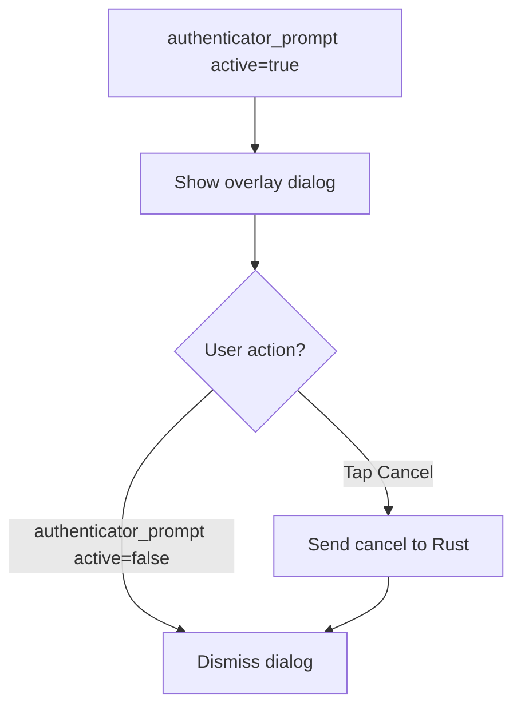

# 09 - Component: Flutter UI

**Assignee**: Developer E
**Estimated effort**: 3-5 days
**Dependencies**: Component 08 (message routing — for event names)
**Files to modify/create**:
- `flutter/lib/models/model.dart` — event handler registration
- `flutter/lib/common/widgets/ctap_prompt.dart` — new prompt widget
- `flutter/lib/desktop/pages/remote_page.dart` — widget integration
- `flutter/lib/mobile/pages/remote_page.dart` — mobile widget integration

## Background

The Flutter UI needs to:
1. Show a "Tap your security key" prompt when a CTAP request arrives
2. Dismiss the prompt when the request completes or is cancelled
3. Provide a "Cancel" button for the user
4. Show the CTAP permission toggle in the connection toolbar

Study these existing patterns:
- Message box handling in `flutter/lib/models/model.dart` line ~889 (`handleMsgBox`)
- Permission toggles in the toolbar (search for "keyboard" or "clipboard" permission)
- Toast notifications for transient status messages

## Events from Rust

The Rust side sends these events via `push_event()`:

### Show prompt

```json
{
    "name": "authenticator_prompt",
    "active": "true",
    "message": "Tap your security key"
}
```

### Dismiss prompt

```json
{
    "name": "authenticator_prompt",
    "active": "false"
}
```

## UI Design

### Prompt Dialog



The prompt should be:
- A non-modal overlay (user can still see the remote desktop)
- Positioned at the bottom-center or top-center of the remote view
- Contains: an icon (key/shield), the message text, a Cancel button
- Animated (pulsing icon or progress indicator to show "waiting")
- Auto-dismissed when `active=false` arrives

### Visual Mockup

```
┌─────────────────────────────────────────────┐
│                                             │
│            🔑 Tap your security key         │
│                                             │
│            [    Cancel    ]                  │
│                                             │
└─────────────────────────────────────────────┘
```

Use the existing RustDesk design language (colors, fonts, border radius).

## Implementation Guide

### Step 1: Register event handler in model.dart

In `flutter/lib/models/model.dart`, find the `handleSessionEvent()` function
(around line 306). Add a new case:

```dart
} else if (name == 'authenticator_prompt') {
  handleAuthenticatorPrompt(evt, sessionId);
}
```

### Step 2: Implement handleAuthenticatorPrompt

```dart
void handleAuthenticatorPrompt(Map<String, dynamic> evt, SessionID sessionId) {
  final active = evt['active'] == 'true';
  final message = evt['message'] ?? 'Tap your security key';

  if (active) {
    // Show the prompt
    parent.target?.ctapModel.showPrompt(message);
  } else {
    // Dismiss the prompt
    parent.target?.ctapModel.hidePrompt();
  }
}
```

### Step 3: Create CtapModel

Create a simple model to track prompt state:

```dart
// In flutter/lib/models/ctap_model.dart (new file)

class CtapModel extends ChangeNotifier {
  bool _promptVisible = false;
  String _promptMessage = '';

  bool get promptVisible => _promptVisible;
  String get promptMessage => _promptMessage;

  void showPrompt(String message) {
    _promptMessage = message;
    _promptVisible = true;
    notifyListeners();
  }

  void hidePrompt() {
    _promptVisible = false;
    notifyListeners();
  }

  void cancel(SessionID sessionId) {
    // Send cancel to Rust side
    // Use the FFI binding to send a CTAP cancel message
    bind.sessionSendCtapCancel(sessionId: sessionId);
    hidePrompt();
  }
}
```

### Step 4: Add CtapModel to the session

In the parent model/session (wherever FfiModel, FileModel, etc. are instantiated),
add:

```dart
late final CtapModel ctapModel = CtapModel();
```

### Step 5: Create the prompt widget

```dart
// In flutter/lib/common/widgets/ctap_prompt.dart (new file)

import 'package:flutter/material.dart';

class CtapPromptOverlay extends StatelessWidget {
  final String message;
  final VoidCallback onCancel;

  const CtapPromptOverlay({
    Key? key,
    required this.message,
    required this.onCancel,
  }) : super(key: key);

  @override
  Widget build(BuildContext context) {
    return Positioned(
      bottom: 80,
      left: 0,
      right: 0,
      child: Center(
        child: Card(
          elevation: 8,
          shape: RoundedRectangleBorder(
            borderRadius: BorderRadius.circular(12),
          ),
          child: Padding(
            padding: const EdgeInsets.symmetric(horizontal: 24, vertical: 16),
            child: Column(
              mainAxisSize: MainAxisSize.min,
              children: [
                // Pulsing key icon
                _PulsingIcon(),
                const SizedBox(height: 12),
                Text(
                  translate(message),
                  style: Theme.of(context).textTheme.titleMedium,
                ),
                const SizedBox(height: 16),
                TextButton(
                  onPressed: onCancel,
                  child: Text(translate('Cancel')),
                ),
              ],
            ),
          ),
        ),
      ),
    );
  }
}

class _PulsingIcon extends StatefulWidget {
  @override
  State<_PulsingIcon> createState() => _PulsingIconState();
}

class _PulsingIconState extends State<_PulsingIcon>
    with SingleTickerProviderStateMixin {
  late AnimationController _controller;

  @override
  void initState() {
    super.initState();
    _controller = AnimationController(
      vsync: this,
      duration: const Duration(milliseconds: 1000),
    )..repeat(reverse: true);
  }

  @override
  void dispose() {
    _controller.dispose();
    super.dispose();
  }

  @override
  Widget build(BuildContext context) {
    return FadeTransition(
      opacity: Tween(begin: 0.5, end: 1.0).animate(_controller),
      child: Icon(
        Icons.vpn_key,
        size: 48,
        color: Theme.of(context).colorScheme.primary,
      ),
    );
  }
}
```

### Step 6: Integrate into remote page

In the remote page widget (both desktop and mobile), add the prompt overlay
as a Stack child that appears when `ctapModel.promptVisible` is true:

```dart
// In the build() method of the remote page, inside the Stack:

ChangeNotifierBuilder(
  builder: (context, child) {
    final ctap = Provider.of<CtapModel>(context);
    if (!ctap.promptVisible) return const SizedBox.shrink();
    return CtapPromptOverlay(
      message: ctap.promptMessage,
      onCancel: () => ctap.cancel(sessionId),
    );
  },
),
```

**Note**: The exact widget composition pattern may differ. Study how existing
overlays (chat, file transfer progress) are integrated into the remote page.

### Step 7: Add FFI function for cancel

In `src/flutter_ffi.rs`, add:

```rust
pub fn session_send_ctap_cancel(session_id: SessionID) {
    if let Some(session) = sessions::get_session_by_session_id(&session_id) {
        session.send_ctap_cancel();
    }
}
```

And in the session interface, implement `send_ctap_cancel()` to send a
`Data::CtapCancel` message through the sender channel, which the io_loop
handles by signaling the cancel channel.

### Step 8: Permission toggle in toolbar

The connection toolbar has toggle options for keyboard, clipboard, etc.
Add a CTAP toggle following the same pattern:

```dart
// In the toolbar permissions section:
if (pi.ctapPassthroughSupported)  // from PeerInfo
  _buildPermissionToggle(
    'ctap',
    'Security Key Passthrough',
    Icons.vpn_key,
  ),
```

### Step 9: Translations

Add to the translation files (`src/lang/*.rs`):

```rust
("Tap your security key", ""),  // Each language file fills in translation
("Security Key Passthrough", ""),
```

## Testing

### Manual Test: Prompt appears

1. Connect to a remote machine with CTAP enabled
2. On the remote machine, open a browser and navigate to a WebAuthn test site
   (e.g., webauthn.io)
3. Click "Authenticate"
4. Verify: prompt appears on the local machine with pulsing key icon
5. Tap the security key
6. Verify: prompt dismisses, authentication succeeds on the remote browser

### Manual Test: Cancel

1. Same as above, but click "Cancel" on the prompt
2. Verify: prompt dismisses, authentication fails on the remote browser

### Manual Test: Permission toggle

1. Connect to a remote machine
2. In the toolbar, find the CTAP toggle
3. Toggle it off
4. Verify: WebAuthn requests on the remote machine do not trigger the prompt

## Acceptance Criteria

- [ ] Prompt appears when `authenticator_prompt` event received with `active=true`
- [ ] Prompt dismisses when event received with `active=false`
- [ ] Prompt has pulsing key icon animation
- [ ] Cancel button sends cancel signal to Rust and dismisses prompt
- [ ] Permission toggle appears in toolbar when server supports CTAP
- [ ] Permission toggle enables/disables the feature
- [ ] Translations are added for all UI strings
- [ ] Widget works on both desktop and mobile layouts
