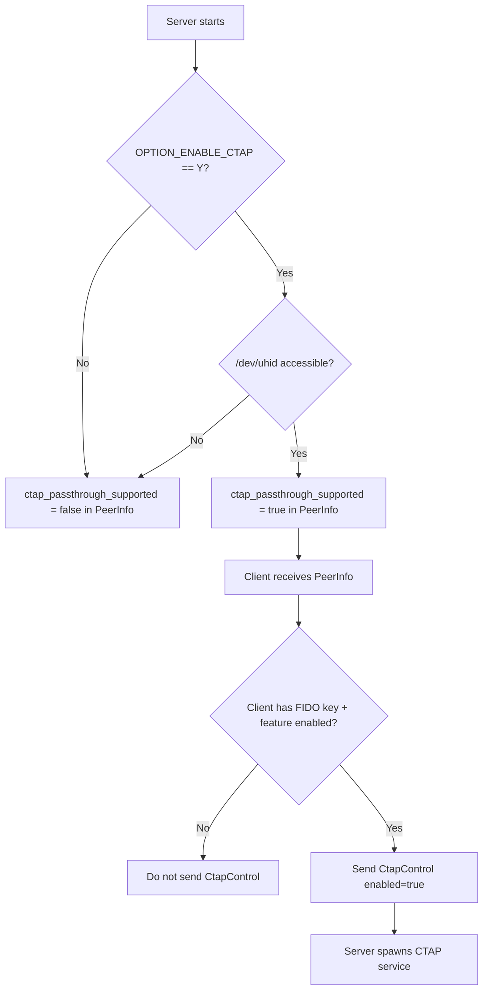

# 10 - Component: Configuration & Permissions

**Assignee**: Developer E
**Estimated effort**: 2-3 days
**Dependencies**: Component 03 (protobuf)
**Files to modify**:
- `libs/hbb_common/src/config.rs`
- `src/server/connection.rs` (permission handling — see Component 08)
- System files: udev rules, documentation

## Background

The CTAP passthrough feature requires:
1. A configuration option to enable/disable it (server-side setting)
2. A permission that can be toggled per-connection (like keyboard/clipboard)
3. System-level setup (udev rules for /dev/uhid and /dev/hidraw access)
4. Runtime checks for prerequisite availability

Study the existing permission system:
- Config keys in `libs/hbb_common/src/config.rs` (line ~2796)
- Permission initialization in `src/server/connection.rs` (line ~426)
- The `OPTION_ENABLE_*` pattern used throughout the codebase

## Requirements

### R1: Add config key

In `libs/hbb_common/src/config.rs`, add:

```rust
pub const OPTION_ENABLE_CTAP: &str = "enable-ctap";
```

Add near the other `OPTION_ENABLE_*` constants (around line 2796-2806).

Default value: **disabled** (`"N"` or absent from options map).

### R2: Add permission mapping

In `src/server/connection.rs`, in the `permission()` function (around line 2160),
add the CTAP mapping:

```rust
keys::OPTION_ENABLE_CTAP => Some(Permission::ctap),
```

(Adjust the exact enum variant name to match whatever protobuf-codegen generates
from `Ctap = 8` in the Permission enum.)

### R3: Runtime availability check

Before advertising CTAP support in PeerInfo, check that the feature is actually
usable on this system:

```rust
/// Check if CTAP passthrough is available on this system.
///
/// Requirements:
/// - Linux only
/// - /dev/uhid exists and is accessible
/// - Feature is enabled in config
pub fn is_ctap_available() -> bool {
    #[cfg(not(target_os = "linux"))]
    return false;

    #[cfg(target_os = "linux")]
    {
        use std::path::Path;

        // Check feature is enabled
        if !Self::is_permission_enabled_locally(keys::OPTION_ENABLE_CTAP) {
            return false;
        }

        // Check /dev/uhid exists
        if !Path::new("/dev/uhid").exists() {
            log::debug!("CTAP: /dev/uhid not found");
            return false;
        }

        // Check /dev/uhid is writable (don't actually open it,
        // just check metadata)
        match std::fs::metadata("/dev/uhid") {
            Ok(meta) => {
                use std::os::unix::fs::MetadataExt;
                // Check we can write (this is a rough check;
                // actual permission depends on our uid/gid)
                let mode = meta.mode();
                // At minimum, check the file exists and is a char device
                if mode & libc::S_IFCHR == 0 {
                    log::debug!("CTAP: /dev/uhid is not a character device");
                    return false;
                }
                true
            }
            Err(e) => {
                log::debug!("CTAP: cannot stat /dev/uhid: {}", e);
                false
            }
        }
    }
}
```

### R4: Set ctap_passthrough_supported in PeerInfo

In `send_logon_response_and_keep_alive()` (around line 1481 in connection.rs),
where PeerInfo is built:

```rust
pi.ctap_passthrough_supported = Self::is_ctap_available();
```

### R5: Udev rules

Create a udev rule file for distribution:

**File**: `res/udev/99-rustdesk-ctap.rules`

```udev
# RustDesk CTAP Passthrough — Virtual FIDO Device
# Allows RustDesk to create virtual FIDO authenticators via /dev/uhid

# Grant access to /dev/uhid for the rustdesk group
KERNEL=="uhid", MODE="0660", GROUP="rustdesk"

# Grant access to the virtual FIDO hidraw device created by RustDesk
# VID 1209 (pid.codes open-source), PID F1D0 (RustDesk FIDO)
SUBSYSTEM=="hidraw", ATTRS{idVendor}=="1209", ATTRS{idProduct}=="f1d0", MODE="0664", GROUP="plugdev"
```

**Installation instructions** (for documentation):

```bash
# Install udev rule
sudo cp res/udev/99-rustdesk-ctap.rules /etc/udev/rules.d/
sudo udevadm control --reload-rules

# Add user to required groups
sudo groupadd -f rustdesk
sudo usermod -aG rustdesk $USER
sudo usermod -aG plugdev $USER

# Load uhid module (if not loaded)
sudo modprobe uhid

# To load uhid automatically on boot:
echo uhid | sudo tee /etc/modules-load.d/uhid.conf
```

### R6: Client-side availability check

The client also needs a runtime check — is there a physical FIDO key connected?

```rust
/// Check if a physical FIDO authenticator is available on this machine.
///
/// This is a quick enumeration — it does NOT open any device.
pub fn is_local_fido_available() -> bool {
    #[cfg(not(target_os = "linux"))]
    return false;

    #[cfg(target_os = "linux")]
    {
        match hidapi::HidApi::new() {
            Ok(api) => {
                api.device_list()
                    .any(|d| d.usage_page() == 0xF1D0 && d.usage() == 0x01)
            }
            Err(e) => {
                log::debug!("hidapi initialization failed: {}", e);
                false
            }
        }
    }
}
```

This is called by the client when deciding whether to send
`CtapControl{enabled: true}` after login.

## Configuration Flow



## Settings UI

The CTAP toggle should appear in:

### Server settings (remote machine)

In the RustDesk settings UI, under "Security" or "Permissions":

```
[x] Allow keyboard input
[x] Allow clipboard sync
[x] Allow file transfer
[ ] Allow security key passthrough    <-- NEW
[x] Allow audio
```

This maps to `OPTION_ENABLE_CTAP` in the config.

### Client settings (local machine)

In the connection toolbar / session settings:

```
Permissions:
  [x] Keyboard
  [x] Clipboard
  [ ] Security Key    <-- NEW (only shown if server supports it)
```

This sends `CtapControl` messages and/or permission switch IPC.

## Testing

### Test: Feature disabled by default

```rust
#[test]
fn test_ctap_disabled_by_default() {
    // Fresh config should not have OPTION_ENABLE_CTAP set
    let config = Config2::default();
    assert_ne!(
        config.options.get(keys::OPTION_ENABLE_CTAP),
        Some(&"Y".to_string())
    );
}
```

### Test: PeerInfo reflects availability

```rust
#[test]
fn test_peer_info_ctap_support() {
    // When CTAP is enabled and uhid is available, PeerInfo should report support
    // (This is an integration test that depends on system state)
}
```

### Manual Test: Udev rules

1. Install the udev rule
2. Add user to `rustdesk` group
3. Log out and back in
4. Verify: `ls -la /dev/uhid` shows group `rustdesk` with mode `0660`
5. Verify: `test -w /dev/uhid && echo "writable"` succeeds

## Acceptance Criteria

- [ ] `OPTION_ENABLE_CTAP` config key exists
- [ ] Feature is disabled by default
- [ ] `Permission::Ctap` is wired into the permission system
- [ ] PeerInfo includes `ctap_passthrough_supported` based on runtime check
- [ ] Runtime check verifies: Linux, /dev/uhid exists, feature enabled in config
- [ ] Client-side check verifies physical FIDO key is connected
- [ ] Udev rule file is created and documented
- [ ] Settings UI shows CTAP toggle on both server and client sides
- [ ] Toggling the setting off stops the CTAP service if running
