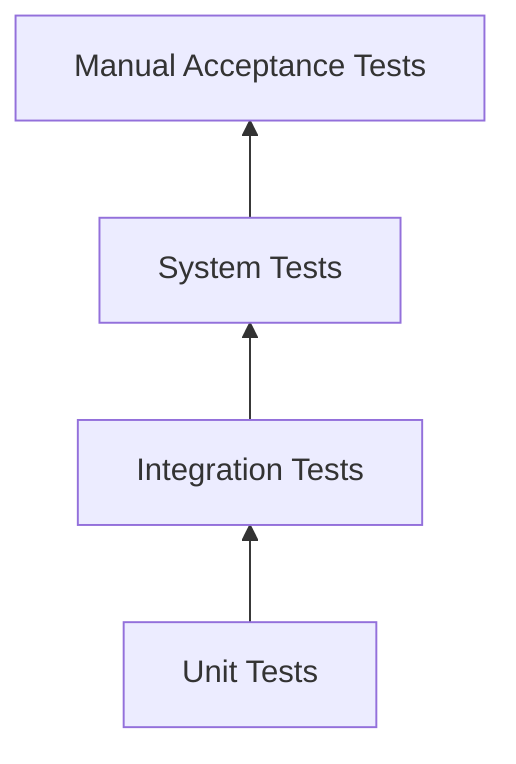
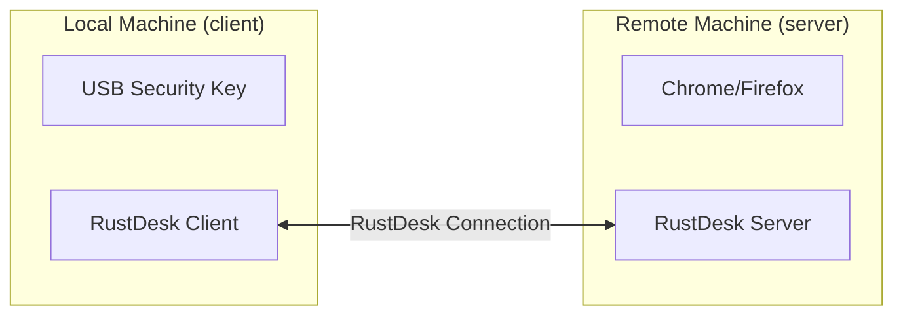

# 11 - Testing Plan

**Audience**: All developers
**Dependencies**: All components

## Test Levels

## Unit Tests

These run in CI without special hardware or permissions.

### CTAPHID Framing (Component 05)

| Test | Description | File |
|------|-------------|------|
| `test_single_packet_cbor` | Fragment and reassemble a 1-byte payload | `src/ctap_hid.rs` |
| `test_multi_packet_message` | Fragment and reassemble 200-byte payload | `src/ctap_hid.rs` |
| `test_max_payload` | Fragment and reassemble 7609-byte payload | `src/ctap_hid.rs` |
| `test_payload_too_large` | Reject payload > 7609 bytes | `src/ctap_hid.rs` |
| `test_init_flow` | INIT request/response construction | `src/ctap_hid.rs` |
| `test_keepalive_construction` | KEEPALIVE message format | `src/ctap_hid.rs` |
| `test_error_construction` | ERROR message format | `src/ctap_hid.rs` |
| `test_sequence_error` | Detect out-of-order continuation packets | `src/ctap_hid.rs` |
| `test_cid_mismatch` | Detect CID mismatch in continuation | `src/ctap_hid.rs` |
| `test_init_resets_assembler` | New INIT during assembly resets state | `src/ctap_hid.rs` |
| `test_round_trip_random` | Fragment and reassemble random payloads (proptest) | `src/ctap_hid.rs` |

### Protobuf Messages (Component 03)

| Test | Description | File |
|------|-------------|------|
| `test_ctap_frame_creation` | Create and serialize CtapFrame | `libs/hbb_common` |
| `test_ctap_frame_round_trip` | Serialize and deserialize CtapFrame | `libs/hbb_common` |
| `test_ctap_control_in_misc` | CtapControl inside Misc message | `libs/hbb_common` |
| `test_ctap_permission_value` | Permission::Ctap has value 8 | `libs/hbb_common` |

### Configuration (Component 10)

| Test | Description | File |
|------|-------------|------|
| `test_ctap_disabled_by_default` | Default config has CTAP off | `src/server/connection.rs` |
| `test_ctap_option_key_exists` | OPTION_ENABLE_CTAP is defined | `libs/hbb_common/src/config.rs` |

## Integration Tests

These require a Linux system with `/dev/uhid` access (run as root or with
appropriate udev rules). Mark with `#[ignore]` for CI — run manually or in
a privileged CI job.

### Virtual Device (Component 04)

| Test | Description |
|------|-------------|
| `test_uhid_create_destroy` | Create a virtual FIDO device, verify it appears in `/sys/class/hidraw/`, destroy it, verify it disappears |
| `test_uhid_report_descriptor` | Create device, read its report descriptor via ioctl on the hidraw node, verify it matches `FIDO_HID_REPORT_DESCRIPTOR` |
| `test_uhid_write_read` | Create device, open the hidraw node, write an output report, read it from uhid as `UHID_OUTPUT` |
| `test_uhid_input_report` | Create device, write `UHID_INPUT2` from uhid, read it from the hidraw node |

### CTAPHID Over Virtual Device (Components 04 + 05)

| Test | Description |
|------|-------------|
| `test_ctaphid_init_over_uhid` | Create virtual device, open hidraw, send INIT request, handle in code, send response, read on hidraw, verify correct response |
| `test_ctaphid_cbor_over_uhid` | Send a CBOR command through hidraw → uhid, reassemble, verify payload matches |
| `test_ctaphid_multi_packet_over_uhid` | Send a large CBOR command that requires continuation packets |

### Remote Service (Component 06)

| Test | Description |
|------|-------------|
| `test_service_init_handling` | Start service, send INIT via hidraw, verify response |
| `test_service_cbor_forwarding` | Start service, send CBOR via hidraw, verify CtapFrame appears on tx channel |
| `test_service_keepalive` | Start service, send CBOR, delay response, verify KEEPALIVEs on hidraw |
| `test_service_response_relay` | Start service, send CBOR, inject response on rx channel, verify on hidraw |
| `test_service_timeout` | Start service, send CBOR, don't respond, verify ERROR after timeout |
| `test_service_cancel` | Start service, send CBOR, send CANCEL, verify forwarded |
| `test_service_reset_blocked` | Send authenticatorReset (0x07) via CBOR, verify rejected |

### Local Driver (Component 07)

These require a physical FIDO2 security key connected via USB.

| Test | Description |
|------|-------------|
| `test_enumerate_fido_device` | Verify `open_first()` finds the connected key |
| `test_get_info` | Send authenticatorGetInfo (0x04), verify valid CBOR response |
| `test_channel_allocation` | Allocate a channel via INIT, verify valid CID |

## System Tests (End-to-End)

These require TWO Linux machines (or VMs) with RustDesk installed, plus a
physical FIDO2 security key.

### Test Environment Setup

**Prerequisites**:
- RustDesk built with CTAP feature enabled on both machines
- udev rules installed on remote machine (for /dev/uhid)
- udev rules installed on local machine (for hidraw access to FIDO key)
- Physical FIDO2 security key (YubiKey 5, SoloKey, or similar)
- Chrome 90+ or Firefox 100+ on remote machine
- A WebAuthn test account (e.g., webauthn.io, passkeys.io, or GitHub with
  security key configured)

### E2E-1: Basic Authentication Flow

**Steps**:
1. Connect local to remote via RustDesk
2. Enable CTAP passthrough in both client and server settings
3. On remote browser, navigate to webauthn.io
4. Register a new credential using the security key
5. Verify: prompt appears on local machine
6. Tap the security key
7. Verify: registration succeeds on the remote browser
8. Log out of webauthn.io
9. Log back in using the same credential
10. Verify: prompt appears again
11. Tap the security key
12. Verify: authentication succeeds

**Expected result**: Full registration + authentication cycle works through the tunnel.

### E2E-2: User Cancellation

**Steps**:
1. Connect and enable CTAP
2. Trigger WebAuthn authentication on remote browser
3. When prompt appears, click "Cancel"
4. Verify: remote browser shows authentication failure
5. Verify: prompt dismisses cleanly

### E2E-3: Timeout

**Steps**:
1. Connect and enable CTAP
2. Trigger WebAuthn authentication on remote browser
3. Do NOT touch the security key
4. Wait 30 seconds
5. Verify: remote browser shows timeout error
6. Verify: prompt dismisses cleanly

### E2E-4: Key Not Connected

**Steps**:
1. Connect and enable CTAP (but do NOT have a security key plugged in)
2. Trigger WebAuthn authentication on remote browser
3. Verify: remote browser shows error (no authenticator available)
4. Verify: no prompt appears on local machine (or prompt shows error)

### E2E-5: Permission Disabled

**Steps**:
1. Connect to remote machine
2. Disable CTAP passthrough in server settings
3. Trigger WebAuthn authentication on remote browser
4. Verify: no prompt appears (browser uses local authenticator or fails)

### E2E-6: Mid-Session Toggle

**Steps**:
1. Connect with CTAP enabled
2. Verify: virtual FIDO device exists on remote (`ls /sys/class/hidraw/`)
3. Toggle CTAP off in toolbar
4. Verify: virtual FIDO device is removed
5. Toggle CTAP on again
6. Verify: virtual FIDO device reappears
7. Trigger WebAuthn authentication — should still work

### E2E-7: Connection Disconnect

**Steps**:
1. Connect with CTAP enabled
2. Verify: virtual FIDO device exists on remote
3. Disconnect the RustDesk session
4. Verify: virtual FIDO device is removed from remote
5. Verify: no orphaned processes or file descriptors

### E2E-8: Multiple Browser Tabs

**Steps**:
1. Connect with CTAP enabled
2. Open two tabs with WebAuthn sites on remote browser
3. Trigger authentication on tab 1
4. Before completing, switch to tab 2 and trigger authentication there
5. Verify: tab 2 gets ERR_CHANNEL_BUSY or is queued
6. Complete authentication on tab 1
7. Verify: tab 2 can then authenticate

### E2E-9: Latency Test

**Steps**:
1. Connect via relay (not direct) for higher latency
2. Trigger WebAuthn authentication
3. Verify: authentication still succeeds (within 30s timeout)
4. Measure time from tap to completion

**Expected**: < 2 seconds additional latency from the tunnel.

## Performance Tests

| Metric | Target | How to measure |
|--------|--------|----------------|
| CTAP transaction latency overhead | < 200ms (direct), < 500ms (relay) | Timestamp at service entry/exit |
| KEEPALIVE jitter | < 50ms | Capture hidraw traffic, measure interval variance |
| Virtual device creation time | < 100ms | Timestamp around uhid create |
| Memory overhead of CTAP service | < 1MB | Process memory before/after enabling |

## Browser Compatibility Matrix

| Browser | Version | Platform | Expected Result |
|---------|---------|----------|-----------------|
| Chrome | 90+ | Linux x86_64 | Full support |
| Chrome | 120+ | Linux ARM64 | Full support |
| Firefox | 100+ | Linux x86_64 | Full support |
| Firefox | 100+ (Snap) | Ubuntu | May fail (AppArmor blocks hidraw) |
| Chromium | 90+ | Linux x86_64 | Full support |
| Edge | Any | Linux | Full support (Chromium-based) |
| Brave | Any | Linux | Full support (Chromium-based) |

## Security Key Compatibility

| Key | VID:PID | Expected Result |
|-----|---------|-----------------|
| YubiKey 5 NFC | 1050:0407 | Full support (CTAP2 + CTAP1) |
| YubiKey 5C | 1050:0407 | Full support |
| YubiKey Security Key | 1050:0120 | Full support |
| SoloKey v2 | 1209:BEEE | Full support (CTAP2 only) |
| Google Titan | 096E:0858 | Full support |
| Feitian ePass FIDO | 096E:0854 | Full support |
| Nitrokey FIDO2 | 20A0:42B1 | Full support |
| Trezor | 1209:53C1 | May need CTAP1 support |
