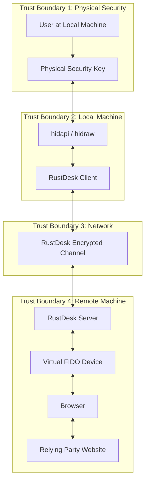

# 12 - Security Analysis

**Audience**: All developers, security reviewers

## Threat Model

### Trust Boundaries



### Assets Under Protection

| Asset | Value | Location |
|-------|-------|----------|
| Private key material | Critical | Never leaves the physical key (hardware-bound) |
| CTAP2 assertions (signatures) | High | Transit through tunnel — replay-resistant by design |
| User presence confirmation | High | Physical touch on local machine |
| RP credentials (cookies, sessions) | High | On remote browser — not touched by CTAP feature |
| RustDesk session encryption key | High | In memory on both machines — pre-existing |

### Threat Analysis

#### T1: Man-in-the-Middle on the Tunnel

**Threat**: An attacker intercepts CTAP messages in transit and modifies them.

**Mitigation**: RustDesk's existing connection is encrypted with a symmetric key
established via public-key exchange during session setup (see `Client::secure_connection()`
in `src/client.rs:758`). CTAP messages travel inside this encrypted channel.

**Residual risk**: If the RustDesk encryption is compromised, CTAP messages are
also exposed. However, CTAP2 assertions are cryptographically bound to the
`rpIdHash` and `clientDataHash` — an attacker cannot modify these without the
authenticator rejecting them.

**Severity**: Low (defense in depth from both RustDesk encryption and CTAP2 crypto).

#### T2: Authenticator Reset via Remote

**Threat**: A malicious remote operator sends `authenticatorReset` (0x07) through
the tunnel, wiping all credentials from the user's security key.

**Mitigation**: The remote CTAP service (Component 06) **MUST** filter CTAP2
command bytes and reject `authenticatorReset` (0x07). This is implemented in
`handle_uhid_report()`:

```rust
if !msg.payload.is_empty() && msg.payload[0] == 0x07 {
    log::warn!("Blocked authenticatorReset command from remote");
    send_error(device, msg.cid, ERR_INVALID_CMD)?;
    return Ok(());
}
```

**Residual risk**: None — reset is blocked at the tunnel entry point.

**Severity**: Critical if unmitigated, None with filter.

#### T3: Credential Management Abuse

**Threat**: Remote operator uses `authenticatorCredentialManagement` (0x0A) to
enumerate or delete credentials stored on the key.

**Mitigation**: The remote service SHOULD also block command 0x0A by default.
Credential management is an administrative operation that should only be
performed locally.

**Recommended filter**: Block commands 0x07 (Reset), 0x09 (BioEnrollment),
0x0A (CredentialManagement), and 0x0D (Config). Only allow:
- 0x01 (MakeCredential)
- 0x02 (GetAssertion)
- 0x04 (GetInfo)
- 0x06 (ClientPIN) — needed for PIN entry
- 0x08 (GetNextAssertion)
- 0x0B (Selection) — harmless

```rust
const ALLOWED_CTAP2_COMMANDS: &[u8] = &[0x01, 0x02, 0x04, 0x06, 0x08, 0x0B];

fn is_allowed_ctap2_command(payload: &[u8]) -> bool {
    payload.first()
        .map(|cmd| ALLOWED_CTAP2_COMMANDS.contains(cmd))
        .unwrap_or(false)
}
```

**Severity**: High if unmitigated, None with filter.

#### T4: Phishing Amplification

**Threat**: A compromised remote machine shows a fake website (e.g., phishing
`g00gle.com` instead of `google.com`) and tricks the user into authenticating.

**Analysis**: This threat exists with or without CTAP passthrough — it's inherent
to remote desktop. The user is already trusting the remote machine's display.
CTAP passthrough does not make this worse because:

- The `rpId` in the CTAP2 request is bound to the actual origin the browser
  navigated to. If the phishing site has a different origin, the credential
  won't match.
- The user can see the remote browser's URL bar (assuming the session is visible).

**Mitigation**: User awareness. The "Tap your security key" prompt could
optionally display the `rpId` extracted from the CTAP2 request (requires parsing
the CBOR payload, which we otherwise treat as opaque — trade-off between security
and complexity).

**Severity**: Medium (inherent to remote desktop, not specific to this feature).

#### T5: Denial of Service via Rapid Requests

**Threat**: The remote side floods CTAP requests, causing constant prompts on
the local machine or hogging the security key.

**Mitigation**: The single-transaction design (only one active CBOR request at
a time) naturally limits throughput. Additional rate limiting could be added:

```rust
const MIN_REQUEST_INTERVAL: Duration = Duration::from_secs(2);
let mut last_request_time = Instant::now() - MIN_REQUEST_INTERVAL;

// In the CBOR handling:
if last_request_time.elapsed() < MIN_REQUEST_INTERVAL {
    send_error(device, msg.cid, ERR_CHANNEL_BUSY)?;
    return Ok(());
}
last_request_time = Instant::now();
```

**Severity**: Low (annoying but not security-critical).

#### T6: Virtual Device Persistence After Disconnect

**Threat**: If the CTAP service crashes without cleanup, the virtual FIDO device
remains in `/dev/hidraw*`, potentially confusing the user or other software.

**Mitigation**:
1. The `VirtualFidoDevice` struct implements `Drop` which sends `UHID_DESTROY`
2. The CTAP service's cleanup runs on both normal and error exit paths
3. The connection close handler (`on_close()`) explicitly stops the CTAP service
4. If the RustDesk process is killed (SIGKILL), the kernel automatically destroys
   uhid devices when the fd is closed (the fd is owned by the process)

**Residual risk**: None — kernel handles the worst case.

**Severity**: Low.

#### T7: Side-Channel via Timing

**Threat**: An observer on the network can determine when the user touches their
security key by measuring the time between the CTAP request and response.

**Analysis**: The timing information reveals:
- That a WebAuthn authentication occurred
- How long it took the user to touch their key

This is minimal information leakage. The content of the CTAP2 messages is
encrypted by RustDesk's transport.

**Severity**: Negligible.

## Security Properties Preserved

| Property | Status | Explanation |
|----------|--------|-------------|
| **Private key never leaves authenticator** | Preserved | Hardware-bound keys cannot be extracted regardless of transport |
| **RP origin binding** | Preserved | `rpIdHash` in the CTAP2 request is generated by the remote browser and validated by the authenticator |
| **Replay resistance** | Preserved | Authenticator counter increments on each signature; `clientDataHash` includes a fresh challenge |
| **User presence** | Preserved | Physical touch is required on the local machine |
| **User verification (PIN)** | Preserved | PIN entry happens on the local machine via the key's own PIN interface |
| **Attestation integrity** | Preserved | We forward raw CTAP2 payloads without modification; attestation signatures are from the real key |

## Security Properties Modified

| Property | Change | Assessment |
|----------|--------|------------|
| **Authenticator proximity** | Weakened | RP assumes authenticator is on same machine as browser. In reality, it may be thousands of miles away. |
| **Channel binding** | N/A | CTAP2 does not have channel binding (unlike TLS token binding). No change. |
| **Phishing resistance** | Unchanged | The `rpId` check still works. Phishing risk is inherent to remote desktop. |

## Comparison with Existing Technologies

| Technology | Mechanism | Security Model |
|------------|-----------|----------------|
| **CTAP Hybrid (caBLE)** | Phone authenticator over cloud tunnel | Same as ours — CTAP over an encrypted tunnel. Accepted by FIDO Alliance. |
| **Qubes OS CTAP Proxy** | uhid in browser VM, USB in sys-usb | Same architecture. Widely deployed in security-conscious environments. |
| **Windows Remote Desktop** | WebAuthn redirection via RDP channel | Similar concept but limited to Azure AD / Windows Hello. |
| **RustDesk CTAP Passthrough** | uhid on remote, hidapi on local | Equivalent security properties to CTAP Hybrid. |

## Recommendations

### Must-have (before merging)

1. Block authenticatorReset (0x07) — **implemented in Component 06**
2. Block authenticatorCredentialManagement (0x0A) — add to filter
3. Block authenticatorBioEnrollment (0x09) — add to filter
4. Block authenticatorConfig (0x0D) — add to filter
5. Feature disabled by default — **implemented in Component 10**
6. Explicit user opt-in required — **implemented via permission toggle**
7. Clean device teardown on disconnect — **implemented via Drop + on_close**

### Should-have (before 1.0 release)

8. Rate limiting on CTAP requests (2-second minimum interval)
9. Log all CTAP operations for audit trail
10. Display rpId in the "Tap your key" prompt (requires CBOR parsing)
11. Option to require user confirmation before each CTAP relay (beyond the key touch)

### Nice-to-have (future)

12. PIN entry UI on the local machine (currently relies on key's built-in PIN)
13. Allowlist of rpIds that can use CTAP passthrough
14. Metrics/telemetry for CTAP usage (number of transactions, success rate)
