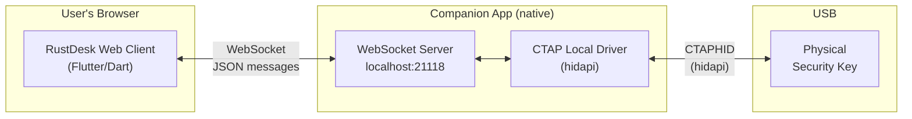

# 13 - Component: CTAP Companion App (Web Client Bridge)

**Assignee**: TBD
**Estimated effort**: 2-3 weeks
**Dependencies**: Component 05 (CTAPHID framing), Component 07 (local driver logic)
**New crate**: `ctap-companion/` (standalone binary, separate from the main RustDesk build)
**New web client code**: `flutter/lib/common/widgets/ctap_websocket.dart`

## Background

The RustDesk web client runs inside a browser, which cannot access physical FIDO2
security keys directly:

- **WebUSB**: Browsers block FIDO devices from the WebUSB API.
- **WebHID**: Chrome blocklists FIDO usage page 0xF1D0 (spec: user agents SHOULD
  deny access to FIDO authenticators). Firefox does not implement WebHID at all.
- **WebAuthn API** (`navigator.credentials.get()`): Enforces `rpId` origin matching.
  The web client's origin does not match the remote website's origin, so the browser
  refuses to process the request. Even if it did, the `clientDataJSON` would contain
  the wrong origin, and the relying party would reject the signature.

To bridge this gap, a small native companion app runs on the user's local machine
and provides raw CTAP2/CTAPHID access to the physical security key over a localhost
WebSocket. The web client connects to this companion and relays `CtapFrame` messages
to it, just as the native client would relay them to its built-in local driver.

## Architecture



### Why a Companion App?

| Alternative | Why not |
|------------|---------|
| WebUSB | Browsers block FIDO devices |
| WebHID | Chrome blocklists FIDO usage page; Firefox has no WebHID |
| WebAuthn API | rpId origin mismatch; browser refuses cross-origin requests |
| Browser extension | Still can't access FIDO HID from extension JS; would need native messaging host anyway, adding two install steps instead of one |
| No web client support | User requirement — web client is the primary target |

### Comparison with Native Client Path

| Concern | Native Client | Web Client |
|---------|--------------|------------|
| How CTAP2 reaches the key | `ctap_local.rs` calls `hidapi` directly | Companion app calls `hidapi`; web client talks to companion via WebSocket |
| Where CTAPHID framing runs | In-process (`ctap_hid.rs`) | In companion process (same `ctap_hid.rs` code) |
| User install | RustDesk native app (already installed) | RustDesk companion (~1-2 MB single binary) |
| Prompt UI | Flutter native widget | Flutter web widget (same `CtapPromptOverlay`) |
| CtapFrame transport | mpsc channels in-process | WebSocket JSON to companion |

## Companion App Design

### Overview

The companion is a **headless, single-binary** Rust application. It:

1. Listens on `localhost:21118` (WebSocket, TLS optional)
2. Accepts connections from the RustDesk web client (origin-checked)
3. Receives CTAP relay requests as JSON messages
4. Talks to the physical FIDO key via `hidapi` (reusing `ctap_hid.rs` and
   the relay logic from `ctap_local.rs`)
5. Returns the response as a JSON message

It has **zero UI** — all prompts are rendered by the web client.

### Port Selection

Use port `21118`. RustDesk already uses ports 21115-21119 for various services.
If 21118 is taken, the companion tries 21119. The web client tries both.

### WebSocket Protocol

All messages are JSON over WebSocket text frames.

#### Discovery / Handshake

The web client connects and sends a `hello`:

```json
// Client → Companion
{
    "type": "hello",
    "version": 1,
    "origin": "https://web.rustdesk.com"
}
```

```json
// Companion → Client
{
    "type": "hello_ack",
    "version": 1,
    "fido_available": true,
    "device_name": "YubiKey 5 NFC"
}
```

`fido_available` indicates whether a FIDO key is currently connected.
`device_name` is best-effort from `hidapi` device info (may be empty).

#### CTAP Relay Request

```json
// Client → Companion
{
    "type": "ctap_relay",
    "id": "req-001",
    "command": 16,
    "payload": "<base64-encoded CTAP2 CBOR>"
}
```

- `id`: Caller-assigned request ID for correlation
- `command`: CTAPHID command byte (16 = 0x10 CBOR, 17 = 0x11 CANCEL)
- `payload`: Base64-encoded raw CTAP2 CBOR data

#### CTAP Relay Response

```json
// Companion → Client
{
    "type": "ctap_response",
    "id": "req-001",
    "command": 16,
    "payload": "<base64-encoded CTAP2 response>",
    "error_code": 0
}
```

- `error_code`: 0 on success, CTAP2 error code on failure
- `payload`: Base64-encoded response (empty on error)

#### CTAP Cancel

```json
// Client → Companion
{
    "type": "ctap_cancel",
    "id": "req-001"
}
```

Cancels an in-progress relay. The companion sends CTAPHID_CANCEL to the key
and returns a response with `error_code: 0x2D` (CTAP2_ERR_KEEPALIVE_CANCEL).

#### Status Events (Companion → Client)

```json
// Companion → Client (unsolicited)
{
    "type": "status",
    "fido_available": true,
    "device_name": "YubiKey 5 NFC"
}
```

Sent when a FIDO device is connected or disconnected (via periodic polling
or OS hotplug notification). The web client can use this to update UI state.

### Security

#### Origin Checking

The companion validates the `Origin` header on the WebSocket upgrade request.
Only allowed origins may connect:

```rust
const ALLOWED_ORIGINS: &[&str] = &[
    "https://web.rustdesk.com",
    "http://localhost",
    "https://localhost",
    "http://127.0.0.1",
    "https://127.0.0.1",
];
```

Self-hosted RustDesk deployments can configure additional allowed origins via
a config file or command-line flag.

#### Localhost Binding

The companion binds to `127.0.0.1` only (not `0.0.0.0`). It is not accessible
from the network.

#### Single Active Session

The companion accepts at most one WebSocket connection at a time. A second
connection attempt receives a `429 Too Many Requests` HTTP response.

#### No Credential Material

The companion never sees or stores credential private keys (those are
hardware-bound in the security key). It only relays opaque CTAP2 CBOR.

#### CTAP2 Command Allowlist

Same as the remote service (Component 06 / 12-security.md), the companion
enforces the CTAP2 command allowlist locally as defense-in-depth:

```rust
const ALLOWED_CTAP2_COMMANDS: &[u8] = &[0x01, 0x02, 0x04, 0x06, 0x08, 0x0B];
```

This prevents a compromised web client from sending `authenticatorReset` (0x07)
or credential management commands to the key.

### Crate Structure

```
ctap-companion/
    Cargo.toml
    src/
        main.rs          # CLI entry point, arg parsing, signal handling
        ws_server.rs     # WebSocket server (tokio + tungstenite)
        protocol.rs      # JSON message types (serde)
        fido_relay.rs    # CTAP2 relay logic (shared with ctap_local.rs)
```

### Dependencies

```toml
[dependencies]
ctap-common = { path = "../libs/ctap-common" }
tokio = { version = "1", features = ["full"] }
tokio-tungstenite = "0.24"
serde = { version = "1", features = ["derive"] }
serde_json = "1"
base64 = "0.22"
log = "0.4"
env_logger = "0.11"
clap = { version = "4", features = ["derive"] }
```

Note: `hidapi` is pulled in transitively via `ctap-common`. The `linux-native`
feature is activated automatically on Linux by `ctap-common`'s platform-conditional
dependency.

### Code Reuse with Native Client

The CTAPHID framing (`ctap_hid.rs`) and the core relay logic from
`ctap_local.rs` should be extracted into a shared library crate so that both
the native RustDesk client and the companion app use the same code:

```
libs/ctap-common/
    Cargo.toml
    src/
        lib.rs
        ctap_hid.rs      # Moved from src/ctap_hid.rs
        fido_relay.rs     # Extracted from src/client/ctap_local.rs
```

Both `rustdesk` (native) and `ctap-companion` depend on `ctap-common`.

### CLI Interface

```
$ ctap-companion --help
RustDesk CTAP Companion — bridges FIDO2 security keys to the RustDesk web client

Usage: ctap-companion [OPTIONS]

Options:
    --port <PORT>          WebSocket listen port [default: 21118]
    --allowed-origin <URL> Additional allowed origin (repeatable)
    --verbose              Enable debug logging
    --version              Print version and exit
```

### Lifecycle

The companion is intended to run in the background while the user has a
RustDesk web session active. Distribution options per platform:

| Platform | Manual | Background Service | Bundled with RustDesk |
|----------|--------|-------------------|----------------------|
| Linux | Download and run | systemd user service | Included in .deb/.rpm |
| Windows | Download and run | Startup folder shortcut or Windows service | Included in MSI/NSIS installer |
| macOS | Download and run | launchd user agent (`~/Library/LaunchAgents/`) | Included in .dmg |

The companion should exit after an idle timeout (5 minutes with no WebSocket
connection) to avoid being a persistent attack surface.

## Web Client Integration

### Dart WebSocket Client

The web client needs a Dart class that manages the WebSocket connection to
the companion app:

```dart
// flutter/lib/common/widgets/ctap_websocket.dart

class CtapCompanionClient {
  WebSocket? _ws;
  bool _fidoAvailable = false;
  String _deviceName = '';
  final Map<String, Completer<Map<String, dynamic>>> _pending = {};

  bool get isConnected => _ws != null;
  bool get fidoAvailable => _fidoAvailable;
  String get deviceName => _deviceName;

  /// Attempt to connect to the local companion app.
  /// Tries port 21118, then 21119.
  Future<bool> connect() async {
    for (final port in [21118, 21119]) {
      try {
        _ws = WebSocket('ws://127.0.0.1:$port');
        await _ws!.onOpen.first.timeout(Duration(seconds: 2));
        _ws!.onMessage.listen(_onMessage);
        _ws!.onClose.listen((_) => _onDisconnect());
        _sendHello();
        return true;
      } catch (_) {
        _ws = null;
      }
    }
    return false;
  }

  /// Relay a CTAP2 command to the physical key via the companion.
  Future<CtapCompanionResponse> relay(int command, Uint8List payload) async {
    final id = _nextId();
    final completer = Completer<Map<String, dynamic>>();
    _pending[id] = completer;

    _send({
      'type': 'ctap_relay',
      'id': id,
      'command': command,
      'payload': base64Encode(payload),
    });

    final resp = await completer.future.timeout(Duration(seconds: 30));
    return CtapCompanionResponse.fromJson(resp);
  }

  /// Cancel an in-progress relay.
  void cancel(String id) {
    _send({'type': 'ctap_cancel', 'id': id});
  }

  void _onMessage(MessageEvent event) {
    final msg = jsonDecode(event.data as String) as Map<String, dynamic>;
    switch (msg['type']) {
      case 'hello_ack':
        _fidoAvailable = msg['fido_available'] as bool;
        _deviceName = msg['device_name'] as String? ?? '';
        break;
      case 'ctap_response':
        final id = msg['id'] as String;
        _pending.remove(id)?.complete(msg);
        break;
      case 'status':
        _fidoAvailable = msg['fido_available'] as bool;
        _deviceName = msg['device_name'] as String? ?? '';
        break;
    }
  }

  // ... helper methods
}
```

### Integration into Web Client Message Handling

On the web client, when a `CtapFrame` arrives from the remote server (via the
shared Rust backend and Flutter FFI bridge), the web client:

1. Checks if the companion is connected (`CtapCompanionClient.isConnected`)
2. If not connected, attempts `connect()` — if that fails, returns an error
   `CtapFrame` to the remote
3. Shows the "Tap your security key" prompt (same `CtapPromptOverlay` widget)
4. Calls `relay(frame.command, frame.payload)` on the companion client
5. On response, sends the result back as a `CtapFrame` to the remote server
6. Dismisses the prompt

This mirrors the native client path in `io_loop.rs` (Component 08, R10-R11),
but replaces the direct `ctap_local::relay_to_physical_key()` call with the
WebSocket relay.

### Platform Detection

The web client should detect whether it's running in a browser and choose the
appropriate relay path:

```dart
// In the CTAP request handler:
if (kIsWeb) {
  // Web client: use companion app via WebSocket
  await _handleCtapViaCompanion(frame);
} else {
  // Native client: use built-in local driver
  await _handleCtapViaNativeDriver(frame);
}
```

### Companion Not Running — User Guidance

If the web client cannot connect to the companion, it should show a helpful
message instead of silently failing:

```
┌─────────────────────────────────────────────────────────────┐
│                                                             │
│  Security key passthrough requires the RustDesk             │
│  CTAP Companion app running on your machine.                │
│                                                             │
│  Download: https://rustdesk.com/ctap-companion              │
│                                                             │
│            [  Download  ]    [  Cancel  ]                   │
│                                                             │
└─────────────────────────────────────────────────────────────┘
```

## Testing

### Unit Tests (companion)

| Test | Description |
|------|-------------|
| `test_protocol_hello` | Serialize/deserialize hello and hello_ack messages |
| `test_protocol_relay` | Serialize/deserialize ctap_relay and ctap_response |
| `test_protocol_cancel` | Serialize/deserialize ctap_cancel |
| `test_origin_validation` | Allowed and rejected origins |
| `test_command_allowlist` | Blocked commands (0x07, 0x09, 0x0A, 0x0D) rejected |
| `test_single_session` | Second connection rejected with 429 |

### Integration Tests (companion + web client)

| Test | Description |
|------|-------------|
| `test_companion_discovery` | Web client finds companion on localhost:21118 |
| `test_companion_relay_round_trip` | Send ctap_relay, receive ctap_response (with mock FIDO device) |
| `test_companion_cancel` | Cancel in-progress relay |
| `test_companion_disconnect` | Companion exits cleanly, web client detects disconnection |
| `test_companion_fido_hotplug` | Connect/disconnect FIDO key, verify status events |

### End-to-End Tests

Add to the E2E tests in `11-testing.md`:

| Test | Description |
|------|-------------|
| E2E-10 | Web client + companion: full WebAuthn registration and authentication |
| E2E-11 | Web client without companion: user sees download guidance |
| E2E-12 | Web client + companion disconnect mid-transaction: graceful error |

## Acceptance Criteria

- [ ] Companion binary builds as a standalone single binary
- [ ] Companion listens on localhost:21118 (WebSocket)
- [ ] Origin validation rejects non-allowed origins
- [ ] Only one WebSocket client at a time
- [ ] Hello/handshake reports FIDO device availability
- [ ] CTAP relay works end-to-end (web client → companion → key → companion → web client)
- [ ] CTAP cancel terminates in-progress relay
- [ ] CTAP2 command allowlist enforced in companion
- [ ] Status events sent on FIDO device connect/disconnect
- [ ] Web client detects companion availability and shows appropriate UI
- [ ] Web client shows download guidance when companion is not running
- [ ] Shared `ctap-common` crate used by both native client and companion
- [ ] Companion builds and runs on Linux, Windows, and macOS
